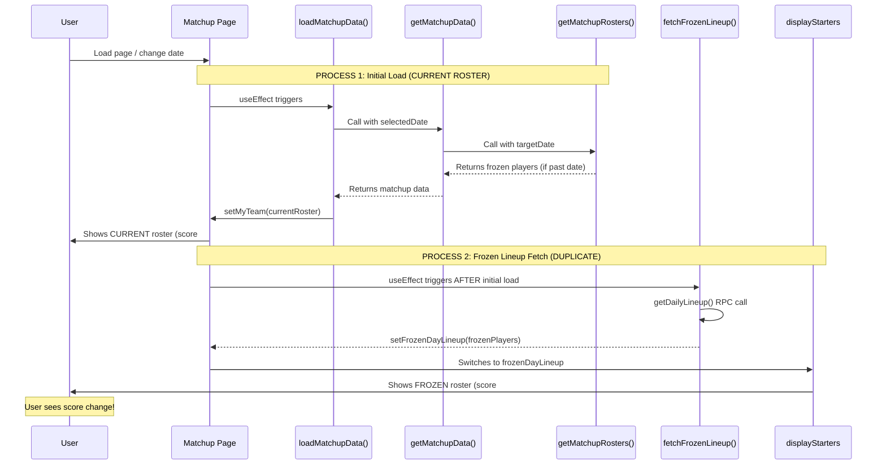
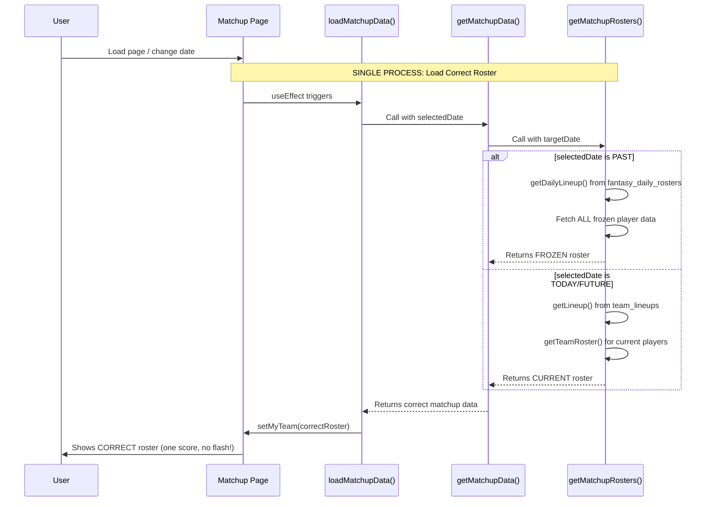

# Fix Duplicate Roster Loading Architecture

## Current Architecture (Broken)

### Data Flow Diagram



### The Problem

**TWO separate data sources:**
1. `myTeam` state - loaded from `getMatchupRosters()` 
2. `frozenDayLineup` state - loaded from `fetchFrozenLineup()` useEffect

**Display logic switches between them:**
```typescript
const displayStarters = useMemo(() => {
  if (frozenDayLineup.date === selectedDate && frozenDayLineup.myStarters.length > 0) {
    return frozenDayLineup.myStarters;  // Use this if available
  }
  return myStarters;  // Otherwise use this
}, [frozenDayLineup, selectedDate, myStarters]);
```

**Results in:**
- ❌ Score flashing (shows current roster first, then frozen)
- ❌ Empty slots (if frozen lineup doesn't match initial load)
- ❌ Two database queries for the same data
- ❌ Race conditions and timing issues
- ❌ Complexity and bugs

## Proposed Architecture (Fixed)

### Data Flow Diagram



### The Solution

**ONE single data source:**
- `myTeam` state - loaded from `getMatchupRosters()` with correct data based on `selectedDate`

**NO switching logic needed:**
- Display uses `myStarters` directly (no conditional logic)
- Data is already correct when loaded

**Results in:**
- ✅ No score flashing (correct data from the start)
- ✅ No empty slots (all frozen players loaded)
- ✅ One database query
- ✅ No race conditions
- ✅ Simple and reliable

## Implementation Changes

### Change 1: Update loadMatchupData to Pass selectedDate

**File**: `src/pages/Matchup.tsx`
**Location**: ~line 2873

**Current**: Already implemented in previous fix ✅
```typescript
const todayStr = getTodayMST();
const useFrozenRoster = selectedDate && selectedDate < todayStr;
const targetDateForRoster = useFrozenRoster ? selectedDate : undefined;

matchupDataPromise = MatchupService.getMatchupData(
  targetLeagueId,
  user.id,
  weekToShow,
  userTimezone,
  existingMatchup,
  targetDateForRoster // Pass date if viewing past date
);
```

### Change 2: Remove Duplicate Frozen Lineup Fetch

**File**: `src/pages/Matchup.tsx`
**Location**: ~line 1052-1200

**Remove entire `fetchFrozenLineup` useEffect**:
```typescript
// DELETE THIS ENTIRE useEffect:
useEffect(() => {
  const fetchFrozenLineup = async () => {
    // ... 150 lines of code ...
  };
  fetchFrozenLineup();
}, [selectedDate, currentMatchup, userTeam, opponentTeam, myTeam, opponentTeamPlayers]);
```

**Reason**: This is duplicate - `getMatchupRosters()` now handles frozen lineup loading

### Change 3: Remove frozenDayLineup State

**File**: `src/pages/Matchup.tsx`
**Location**: ~line 53

**Remove**:
```typescript
const [frozenDayLineup, setFrozenDayLineup] = useState<{
  myStarters: MatchupPlayer[];
  oppStarters: MatchupPlayer[];
  date: string | null;
}>({ myStarters: [], oppStarters: [], date: null });
```

**Reason**: No longer needed - `myTeam` is already correct

### Change 4: Simplify Display Logic

**File**: `src/pages/Matchup.tsx`
**Location**: ~line 2186-2207

**Before**:
```typescript
const displayStarters = useMemo(() => {
  if (frozenDayLineup.date === selectedDate && frozenDayLineup.myStarters.length > 0) {
    console.log('[Matchup] Using frozen lineup for display:', selectedDate);
    return frozenDayLineup.myStarters;
  }
  return myStarters;
}, [frozenDayLineup, selectedDate, myStarters]);

const displayOpponentStarters = useMemo(() => {
  if (frozenDayLineup.date === selectedDate && frozenDayLineup.oppStarters.length > 0) {
    return frozenDayLineup.oppStarters;
  }
  return opponentStarters;
}, [frozenDayLineup, selectedDate, opponentStarters]);
```

**After**:
```typescript
// No switching needed - data is already correct!
const displayStarters = useMemo(() => myStarters, [myStarters]);
const displayOpponentStarters = useMemo(() => opponentStarters, [opponentStarters]);
```

**Reason**: `myStarters` and `opponentStarters` are already the correct data (frozen for past, current for today/future)

### Change 5: Verify getMatchupRosters Logic

**File**: `src/services/MatchupService.ts`
**Location**: ~line 1808-1850

**Already implemented in previous fix** ✅:
- When `useFrozenRoster` is true (past date):
  - Fetches frozen lineup from `getDailyLineup()`
  - Fetches ALL player data for frozen lineup players
  - Returns complete frozen roster with all player details
- When `useFrozenRoster` is false (today/future):
  - Uses current `getLineup()` and `getTeamRoster()`
  - Returns current roster

## Testing Checklist

### Before Fix (Current Behavior)
- [ ] Load past date - see score flash from one number to another
- [ ] Load past date - see empty slots briefly
- [ ] Check browser console - see two sets of logs for roster loading
- [ ] Check network tab - see duplicate queries

### After Fix (Expected Behavior)
- [ ] Load past date - score shows correct frozen value immediately (no flash)
- [ ] Load past date - all slots filled correctly from the start
- [ ] Check browser console - see single set of logs for roster loading
- [ ] Check network tab - see single query for roster data
- [ ] Switch between dates - smooth transitions, no flashing
- [ ] Verify frozen roster for Jan 6 matches exactly what was saved
- [ ] Verify current roster for today shows latest changes

## Key Principles

1. **Single Source of Truth**: One data load process, not two
2. **Load Correct Data**: Load the right data based on date from the start
3. **No Post-Processing**: Don't load current data then override with frozen
4. **Yahoo/Sleeper Model**: One clean load, correct data immediately
5. **No Score Flashing**: User sees correct data instantly

## Benefits

- **Performance**: One query instead of two
- **Reliability**: No race conditions or timing issues
- **User Experience**: No flashing or empty slots
- **Maintainability**: Simpler code, easier to debug
- **Scalability**: Clean architecture for future features

