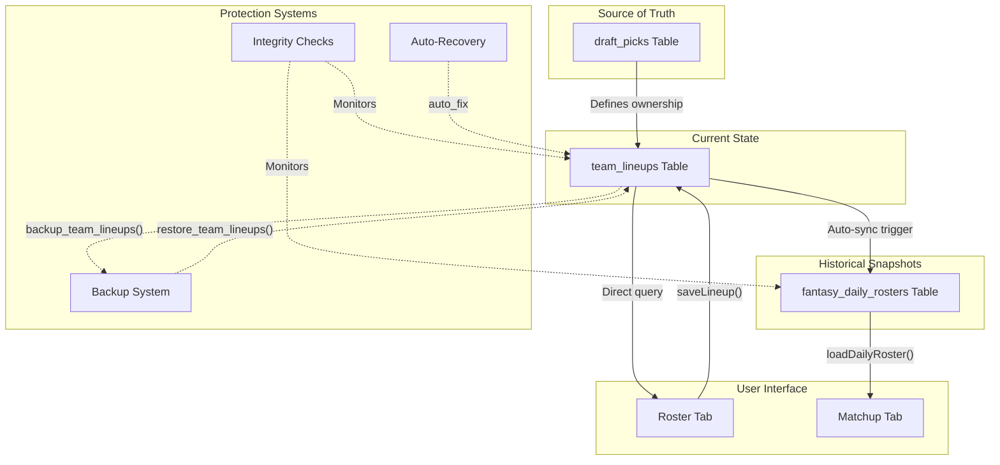
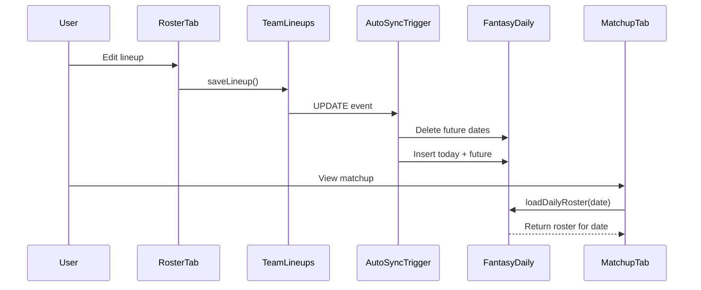
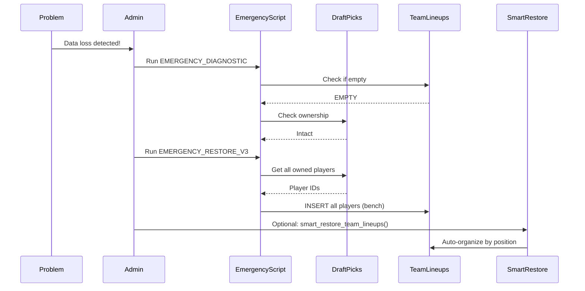
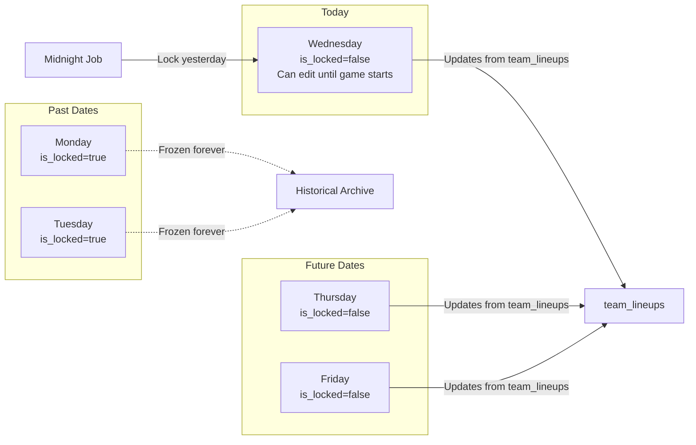
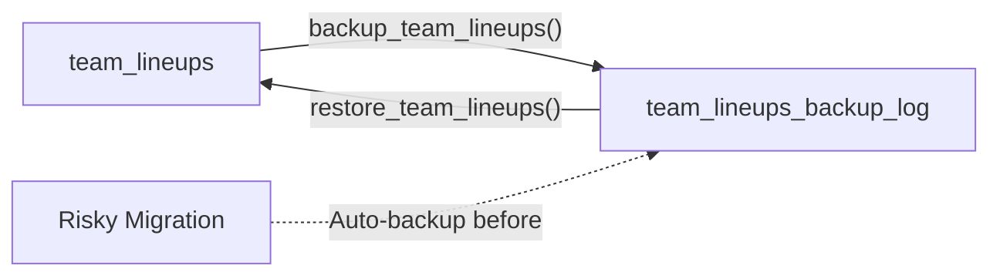
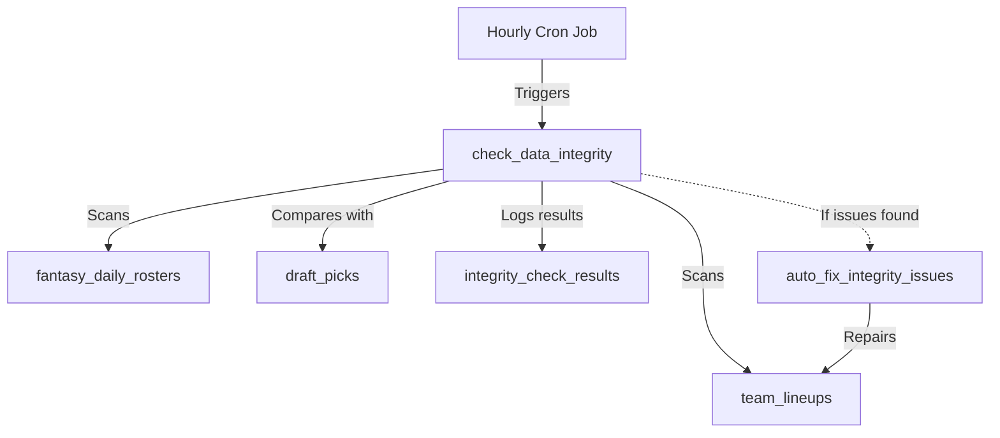
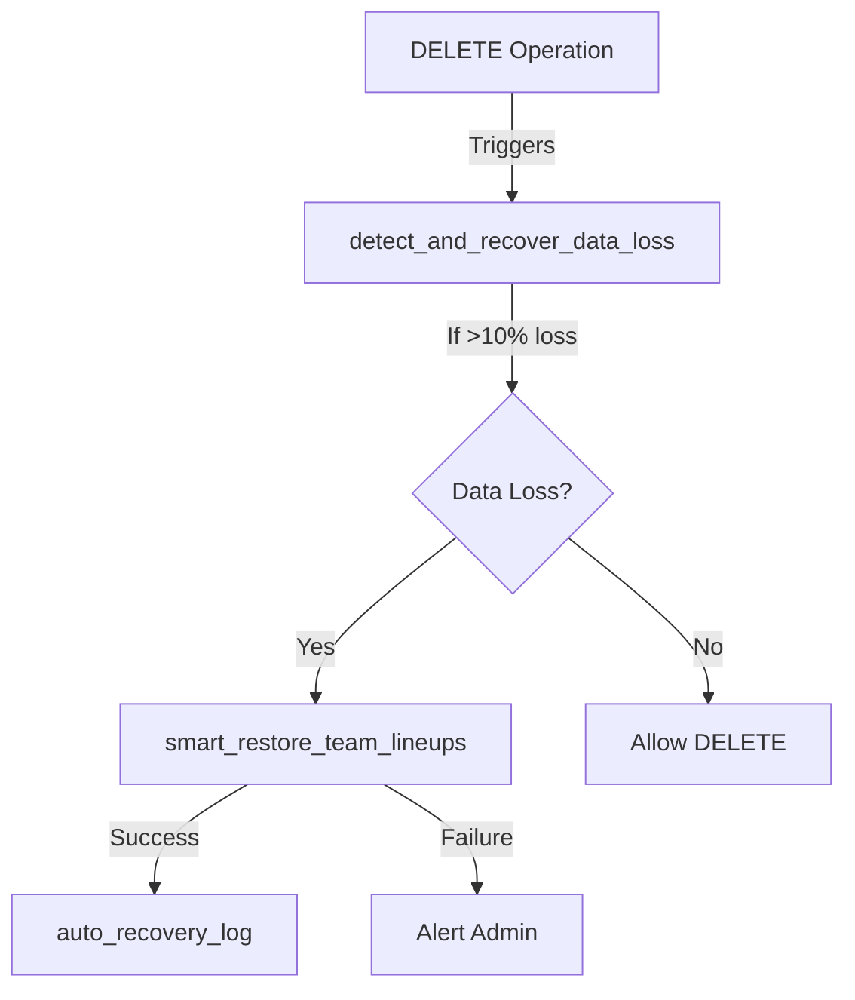
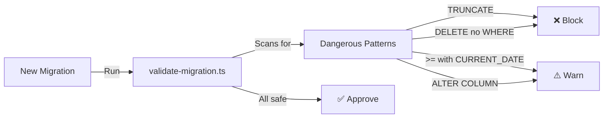
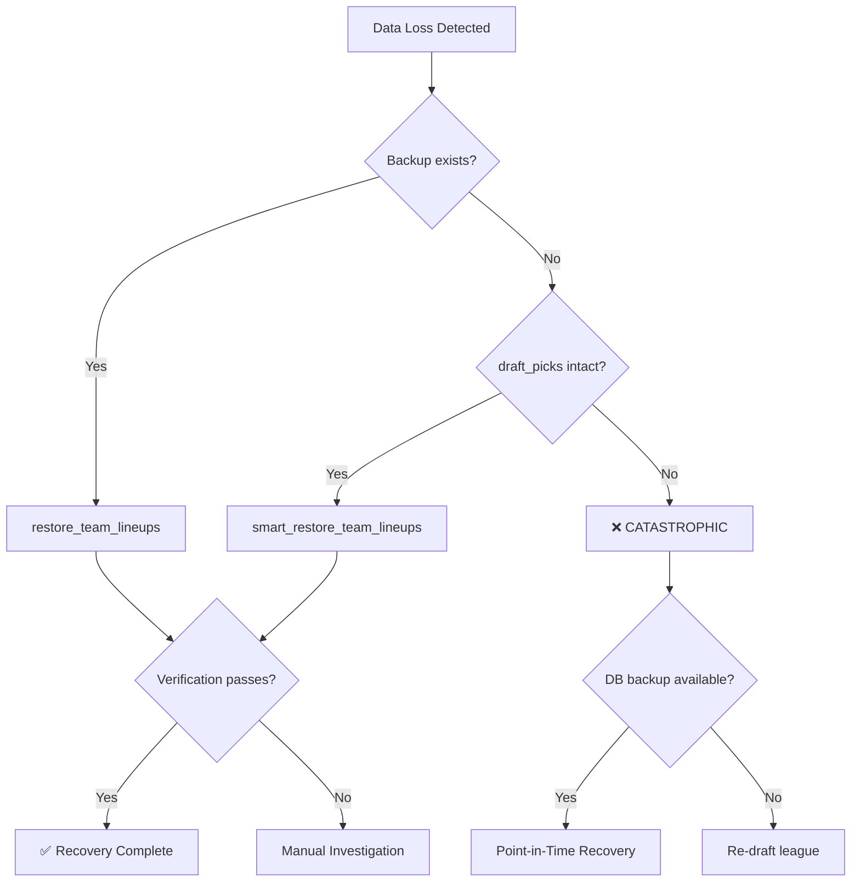
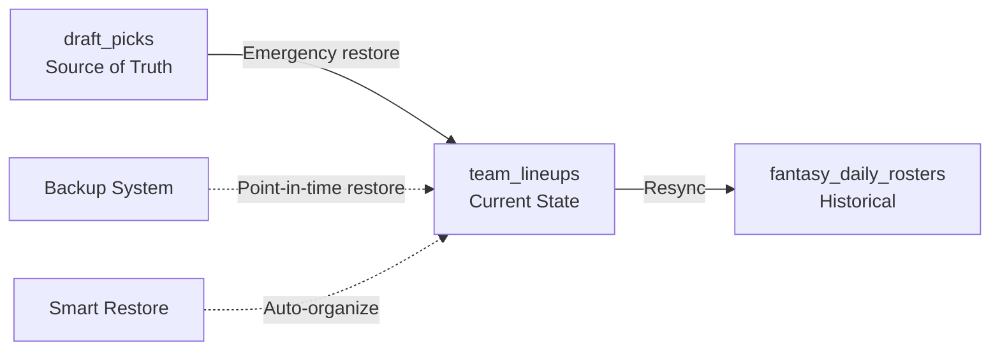

# Data Flow Architecture

## System Overview

The fantasy hockey platform uses a 3-tier data model for roster management:



---

## Table Responsibilities

### draft_picks (Source of Truth)

**Purpose:** Records player ownership via draft/trades/waivers

**Key fields:**
- `team_id` (UUID) - Which team owns the player
- `player_id` (TEXT) - NHL player ID  
- `deleted_at` (TIMESTAMP) - NULL = active, NOT NULL = dropped

**Rules:**
- NEVER delete rows (soft delete via `deleted_at`)
- This is the ULTIMATE source of truth
- Can ALWAYS recover from this table

**Used for:**
- Determining ownership
- Free agency (players NOT in active draft_picks)
- Emergency restoration

---

### team_lineups (Current State)

**Purpose:** Current roster organization (starters/bench/IR)

**Key fields:**
- `team_id` (UUID PRIMARY KEY) - One row per team
- `starters` (JSONB) - Array of player IDs in starting lineup
- `bench` (JSONB) - Array of player IDs on bench
- `ir` (JSONB) - Array of player IDs on IR
- `slot_assignments` (JSONB) - Maps player_id → slot (e.g., "slot-C-1")

**Rules:**
- Updated when user edits lineup in Roster tab
- Triggers sync to `fantasy_daily_rosters` (for today + future)
- NEVER manually truncate this table

**Used for:**
- Roster tab display
- Lineup editing
- Source for daily roster snapshots

---

### fantasy_daily_rosters (Historical Snapshots)

**Purpose:** Day-by-day roster history for scoring and matchups

**Key fields:**
- `team_id`, `matchup_id`, `player_id`, `roster_date` (COMPOSITE KEY)
- `slot_type` - 'active', 'bench', or 'ir'
- `slot_id` - Position slot (e.g., "slot-C-1")
- `is_locked` (BOOLEAN) - True for past dates (frozen)

**Rules:**
- One row per player per day per team
- Past dates (is_locked=true) are FROZEN forever
- Today + future dates update when team_lineups changes
- Used for matchup scoring and historical views

**Used for:**
- Matchup tab display
- Daily scoring calculations
- Historical roster views
- Yahoo/Sleeper-style per-day rosters

---

## Data Flow Diagrams

### Normal Operations



### Emergency Recovery



### Daily Roster Locking



---

## Sync Mechanisms

### Automatic Sync (Bulletproof Trigger)

**When:** User saves lineup in Roster tab

**What happens:**
1. Trigger fires on `team_lineups UPDATE`
2. Validates inputs
3. Deletes entries for `roster_date > CURRENT_DATE` (future only)
4. Inserts/updates from today through end of matchup week
5. Logs operation
6. Handles errors gracefully

**Why TODAY is included:**
- Lineups can change until player's game starts
- Once game starts, player is locked (can't be moved)
- This is Yahoo/Sleeper standard behavior

### Manual Sync (Resync Migration)

**When:** After data loss or corruption

**What happens:**
1. Delete all non-locked entries
2. Repopulate from `team_lineups` for all teams
3. Covers all dates in active matchups
4. Validates counts

**Use case:** Emergency restoration after catastrophic failure

---

## Protection Layers

### Layer 1: Backup System



**Functions:**
- `backup_team_lineups(name, notes)` - Create snapshot
- `restore_team_lineups(backup_id)` - Restore from snapshot
- `list_team_lineups_backups()` - View available backups

### Layer 2: Integrity Monitoring



**Checks performed:**
1. Player counts match between draft_picks and team_lineups
2. fantasy_daily_rosters synced with team_lineups
3. No phantom players
4. No missing players

### Layer 3: Auto-Recovery



**Behavior:**
- Detects when team loses all players
- Automatically restores from draft_picks
- Logs all recovery attempts
- Can be disabled for safety (disabled by default)

### Layer 4: Migration Validation



---

## Recovery Hierarchy

If data is lost, recover in this order:



---

## Data Ownership & Trust

### Chain of Trust

1. **draft_picks** = 100% trusted (source of truth)
2. **team_lineups** = 95% trusted (can be restored from draft_picks)
3. **fantasy_daily_rosters** = 90% trusted (can be restored from team_lineups)

### Recovery Paths



**Key principle:** As long as `draft_picks` is intact, everything else can be rebuilt.

---

## Type Schema (Current State)

### Player ID Mapping

```
draft_picks.player_id:     TEXT (e.g., "8478402")
players.id:                 UUID (database ID, different from NHL ID)
team_lineups.starters:      JSONB[INTEGER] (e.g., [8478402, 8477934])
fantasy_daily_rosters.player_id: INTEGER (e.g., 8478402)
```

**Inconsistency noted:** Mixed types cause casting errors.

**Future fix:** Standardize to INTEGER across all tables.

---

## Query Patterns

### Get Team's Roster (Roster Tab)

```sql
-- Direct query to team_lineups
SELECT starters, bench, ir, slot_assignments
FROM team_lineups
WHERE team_id = 'team-uuid' 
  AND league_id = 'league-uuid';
```

### Get Daily Roster (Matchup Tab)

```sql
-- Query fantasy_daily_rosters for specific date
SELECT player_id, slot_type, slot_id
FROM fantasy_daily_rosters
WHERE team_id = 'team-uuid'
  AND matchup_id = 'matchup-uuid'
  AND roster_date = '2026-01-15';
```

### Get Owned Players (Free Agency)

```sql
-- Query draft_picks for active ownership
SELECT DISTINCT player_id
FROM draft_picks
WHERE league_id = 'league-uuid'
  AND deleted_at IS NULL;

-- Free agents = players NOT in above set
```

---

## Daily Operations

### Midnight Job

Every night at midnight (America/Denver):

1. **Lock yesterday's rosters:**
   ```sql
   UPDATE fantasy_daily_rosters
   SET is_locked = true,
       locked_at = NOW()
   WHERE roster_date = CURRENT_DATE - INTERVAL '1 day'
     AND is_locked = false;
   ```

2. **Run integrity check:**
   ```sql
   SELECT * FROM check_data_integrity();
   ```

3. **Auto-fix if needed:**
   ```sql
   SELECT * FROM auto_fix_integrity_issues();
   ```

4. **Cleanup old backups:**
   ```sql
   SELECT cleanup_old_backups(30);  -- Keep 30 days
   ```

---

## Migration Impact Matrix

| Migration Type | Affects | Risk | Backup Required |
|----------------|---------|------|-----------------|
| Add column | Schema only | LOW | No |
| Add index | Performance only | LOW | No |
| Update rows | Data | MEDIUM | Recommended |
| Delete rows | Data | HIGH | YES |
| Alter column type | Schema + Data | HIGH | YES |
| Drop column | Data (permanent loss) | HIGH | YES |
| Truncate table | Data (total loss) | CATASTROPHIC | YES |
| Drop table | Data (total loss) | CATASTROPHIC | YES |

---

## Error Scenarios & Recovery

### Scenario 1: team_lineups corrupted/empty

**Detection:**
```sql
SELECT COUNT(*) FROM team_lineups;  -- Returns 0 or very low
```

**Recovery:**
```sql
-- Option A: From backup
SELECT restore_team_lineups(get_latest_backup_id());

-- Option B: From draft_picks
-- Run: EMERGENCY_RESTORE_TEAM_LINEUPS_V3.sql

-- Option C: Smart restore
SELECT * FROM smart_restore_all_teams();
```

### Scenario 2: fantasy_daily_rosters out of sync

**Detection:**
```sql
SELECT * FROM check_data_integrity();
-- Shows: fantasy_daily_rosters_sync_today = 'fail'
```

**Recovery:**
```sql
-- Resync from team_lineups
-- Run: supabase/migrations/20260115000005_complete_roster_resync_all_dates.sql
```

### Scenario 3: Specific player missing

**Detection:**
- User reports player missing from roster
- Player appears in draft_picks but not team_lineups

**Recovery:**
```sql
-- Check ownership
SELECT * FROM draft_picks WHERE player_id = '8478402' AND deleted_at IS NULL;

-- If owned, restore
SELECT manual_recover_team('team-uuid');

-- Or auto-fix
SELECT * FROM auto_fix_integrity_issues();
```

---

## Best Practices

### For Developers

1. **Always query draft_picks for ownership truth**
2. **Use team_lineups for current state only**
3. **Use fantasy_daily_rosters for historical views**
4. **Never assume data exists - always validate**
5. **Soft delete (deleted_at) instead of hard delete**

### For Migrations

1. **Create backup before destructive ops:**
   ```sql
   SELECT backup_team_lineups('before_risky_operation', 'Description');
   ```

2. **Validate after migration:**
   ```sql
   SELECT * FROM check_data_integrity();
   ```

3. **Test rollback procedure:**
   ```sql
   -- Document exact rollback steps
   ```

### For Monitoring

1. **Run daily integrity check:**
   ```sql
   SELECT * FROM check_data_integrity();
   ```

2. **Review recovery logs weekly:**
   ```sql
   SELECT * FROM auto_recovery_log ORDER BY recovery_time DESC;
   ```

3. **Monitor backup age:**
   ```sql
   SELECT backup_name, created_at 
   FROM team_lineups_backup_log 
   ORDER BY created_at DESC 
   LIMIT 1;
   ```

---

## Critical Dependencies

### For Roster Tab to Work
- `team_lineups` must exist for the team
- `draft_picks` must have ownership records
- `teams` and `leagues` tables must be valid

### For Matchup Tab to Work
- `fantasy_daily_rosters` must have entries for the date
- `team_lineups` must be synced (via trigger or manual resync)
- `matchups` table must have valid matchup record

### For Scoring to Work
- `fantasy_daily_rosters` must have complete historical data
- `player_game_stats` must have stats for the dates
- `is_locked` must be true for past dates (prevent manipulation)

---

## Future Improvements

### Short-term
- [ ] Standardize player_id types to INTEGER across all tables
- [ ] Add unique constraint on team_lineups(team_id, league_id)
- [ ] Enable auto-recovery trigger after testing
- [ ] Set up hourly integrity checks via pg_cron

### Medium-term
- [ ] Implement CDC (Change Data Capture) for audit trail
- [ ] Add versioning to team_lineups (track all changes)
- [ ] Real-time sync to reduce lag
- [ ] Automated migration testing pipeline

### Long-term
- [ ] Multi-region replication
- [ ] Automated failover
- [ ] ML-based anomaly detection
- [ ] Predictive data quality monitoring

---

**Last Updated:** January 15, 2026  
**Architecture Version:** 2.0 (Post-incident hardening)
