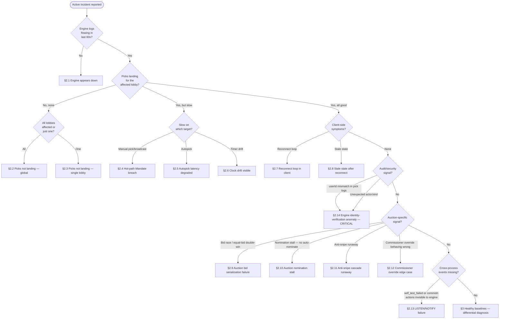
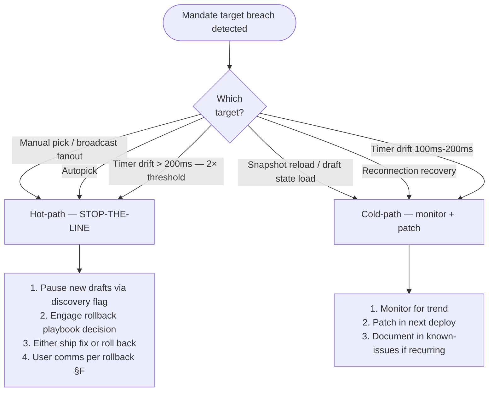
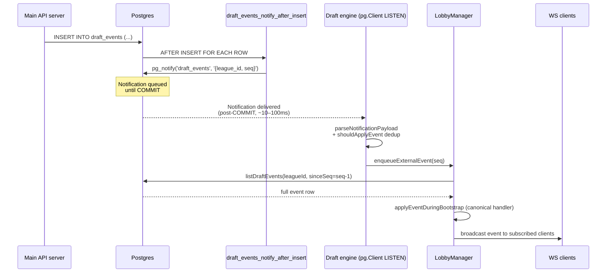

# Draft Engine — Operations Runbook

> **Status:** post-11g.9 persistent-engine operations. First real version
> (the prior version was a Phase 0 stub).
> **Audience:** solo on-call (today: Garrett). Time-to-action is the
> primary design constraint. Every section answers "what do I do RIGHT
> NOW" before "why."
> **Companion docs:**
> - [`README.md`](./README.md) — which runbook for which situation.
> - [`draft-engine-v2-staging-preflight.md`](./draft-engine-v2-staging-preflight.md) — pre-deploy verification.
> - [`draft-engine-v2-known-issues.md`](./draft-engine-v2-known-issues.md) — recurring quirks + KI registry.
> - [`draft-engine-v2-rollback-playbook.md`](./draft-engine-v2-rollback-playbook.md) — when to roll back and how.

---

## ⚠ Legacy-path warning

If during an incident you find yourself reaching for `pgmq`,
`draft_deadline_sweep`, `draft-autopick` Edge Function, or pg_cron jobs
named `draft-deadline-*` / `draft-autopick-*` — **stop.** These were
DROP CASCADE'd in chunk 11g.9 (irreversible). They do not exist. The
persistent in-server engine owns autopick (`LobbyManager.handleClockExpired`
+ `setTimeout` per draft); recovery is event-log replay + snapshot+delta
bootstrap; cross-process signaling is LISTEN/NOTIFY. Anything else is
muscle memory from the pre-11g.9 architecture and will not help you.

---

## §1 Triage decision tree (the "11pm Saturday" section)

Start here for any active incident. The leaves point to per-symptom
playbooks in §2. If no leaf matches, jump to §3 healthy baselines for
differential diagnosis.



### When in doubt about severity

If the answer to "is this user-visible during an active live draft" is
**yes**, treat as Tier 1 per §7. Tier-1 incidents bypass "wait and see"
posture — go straight to the rollback playbook decision-time framework.

---

## §2 Per-symptom playbooks

Each playbook follows the same template:

- **Detection signal** — what the on-call observes.
- **Architectural truth** — the invariant that holds even in this failure.
- **Auto-recovery** — what happens without intervention.
- **Manual intervention** — concrete commands, in order.
- **Escalation** — when to invoke a rollback scenario.
- **Verification** — how you know it's fixed.

### §2.1 Engine appears down

- **Detection signal.** No engine logs in the last 60s. WS reconnect storm
  visible client-side (`uws.connection.closed` events stopped; clients
  retrying). HTTP routes that hit engine in-process return 502/timeouts.
- **Architectural truth.** Postgres `draft_events` is durable; no committed
  picks are lost. Engine restart triggers snapshot+delta bootstrap (chunk
  11g.7-7c); full event-replay is the belt-and-suspenders fallback.
- **Auto-recovery.** None at the process level — engine is a Node process.
  Restart is manual or platform-managed (GCE startup script).
- **Manual intervention.**
  1. Check process status:
     ```bash
     # On GCE VM:
     ssh <vm-name> "sudo systemctl status citrus-draft-engine"
     # Or, if running under Docker:
     ssh <vm-name> "docker ps --filter name=citrus-draft-engine"
     ```
  2. Pull recent logs:
     ```bash
     # If systemd-managed:
     ssh <vm-name> "sudo journalctl -u citrus-draft-engine -n 200 --no-pager"
     # If Docker:
     ssh <vm-name> "docker logs --tail 200 citrus-draft-engine"
     ```
  3. If process is dead and logs show a crash (uncaught exception, OOM):
     restart it. Engine bootstrap will resume all active drafts via
     snapshot+delta from `draft_snapshots` (most recent snapshot per
     in-progress draft) + replay of events since `lastAppliedSeq`.
  4. Watch for `snapshot.bootstrap.applied` (info) per active lobby and
     `event_subscription.started` (info) within 5s. If
     `event_subscription.self_test_failed` (error) fires, jump to §2.13.
  5. If process is alive but unresponsive (no log output, high CPU): take
     a heap snapshot before killing (`kill -USR1 <pid>` if heap-snapshot
     handler installed; otherwise capture process state via
     `ps -p <pid> -o pid,vsz,rss,pcpu,stat`), then restart.
- **Escalation.** If restart fails repeatedly or bootstrap surfaces
  `snapshot.bootstrap.fallback_full_replay` for every lobby AND event
  count is high (>2000 events per lobby), see rollback playbook
  scenario #5 (snapshot table corruption) and scenario #1 (bad migration).
- **Verification.** All previously-active lobbies have `registry.lobby_added`
  + `snapshot.bootstrap.applied` logs. Smoke-test by connecting a WS client
  to one affected lobby; confirm `uws.connection.opened` + a resync event
  delivered.

### §2.2 Picks not landing — global (all lobbies)

- **Detection signal.** Picks submitted across multiple lobbies fail to
  appear in `draft_events`; clients see submit-action timeouts; engine logs
  show RPC error rate on `submit_pick_v2` > 1%.
- **Architectural truth.** Postgres is shared durability; engine writes
  via existing v2 RPCs. Two failure classes: (a) engine cannot reach
  Postgres (connection pool exhaustion, network), (b) RPC itself is failing
  (auth, schema, constraint).
- **Auto-recovery.** Engine retries are NOT automatic for `submit_pick_v2`
  — each pick is a discrete user-initiated action. The single-writer queue
  serializes attempts but does not retry on error.
- **Manual intervention.**
  1. Identify which RPC is failing in engine logs (search for
     `submit_pick_v2`-related errors). If errors include
     `unauthorized: caller … is not owner of team …`, jump to §2.14
     (identity-verification anomaly — could indicate ADR-004 §6 incident).
  2. If errors include connection / pool exhaustion: check engine's
     Supabase admin client connection state. Engine uses
     `getSupabaseAdmin()` (one shared client constructed at process
     startup). Restart engine to reset client.
  3. If errors include schema / constraint: check
     `supabase/migrations/` for a recent migration that changed
     `submit_pick_v2` or related tables. See rollback playbook
     scenario #1 (bad migration).
  4. Check Supabase project health independently:
     ```sql
     -- Run via Supabase Dashboard SQL Editor:
     SELECT now(), current_database(), version();
     SELECT count(*) FROM draft_events WHERE created_at > now() - interval '5 minutes';
     ```
- **Escalation.** If Postgres is healthy but engine cannot write, and
  restart does not fix, invoke rollback playbook scenario #2 (engine
  binary regression) — revert to the previously-known-good SHA.
- **Verification.** RPC error rate on `submit_pick_v2` drops below 1%
  in 5-min window; new picks appear in `draft_events` within seconds of
  submission.

### §2.3 Picks not landing — single lobby

- **Detection signal.** One lobby's picks fail; other lobbies unaffected.
  Affected lobby's WS clients see submit-action timeouts or 4xx responses.
- **Architectural truth.** Each `LobbyManager` is an independent instance
  in `LobbyRegistry`. Lobby-scoped failures are usually state-machine bugs
  (auction nomination state stuck, snake pick-counter divergence) or auth
  failures (per ADR-004 §5.3 the engine verifies team authorization before
  every pick; an authorization mismatch fails this lobby's picks while
  others continue).
- **Auto-recovery.** None — lobby state stays as-is until intervention.
- **Manual intervention.**
  1. Identify the lobby (`lobbyId` is in the affected WS client's debug
     panel or `uws.upgrade.accepted` log lines).
  2. Pull lobby-scoped logs:
     ```bash
     ssh <vm-name> "sudo journalctl -u citrus-draft-engine -n 500 --no-pager | grep <lobbyId>"
     ```
  3. Check for repeating `unauthorized` errors (identity-verification —
     §2.14), `payload_hash` mismatch (idempotency divergence — see
     known-issues KI registry), or auction-specific state errors
     (§2.10–§2.12).
  4. If state-machine state is wedged but no error pattern is clear,
     force a snapshot persistence to capture current state, then restart
     ONLY the affected lobby via registry eviction:
     ```bash
     # NOTE: requires admin HTTP endpoint TODO(10b/10c): document the
     # admin endpoint when it lands. Until then, full engine restart
     # is the only manual lobby-eviction path. Engine restart triggers
     # bootstrap for ALL lobbies, which is heavier than needed but safe.
     ```
- **Escalation.** If the lobby reproduces the failure after engine restart,
  the state is durably wedged in Postgres (likely auction nomination state
  or `draft_picks_v2` inconsistency). Engage commissioner override per
  ADR-002 §3 commissioner-override action set; if no override fits,
  pause the draft (`draft_pause` RPC) and notify the league via the
  user-comms template "Drafts paused, will resume" from
  rollback playbook §F.
- **Verification.** Pick submission for the lobby succeeds; `draft_events`
  row appears; broadcast fans out to all connected clients in that lobby.

### §2.4 Hot-path Mandate breach (manual pick / broadcast fanout)

- **Detection signal.** Manual pick p95 or p99 exceeds CLAUDE.md §"Hard
  performance targets" thresholds. Surfaced by 10d alert policy
  `mandate.manual_pick.p95_breach` (TODO(10d): wire alert when monitoring
  lands).
- **Architectural truth.** Manual pick path = WS receive → action queue
  → `submit_pick_v2` RPC commit → uWS publish (chunk 11g.4 step 6).
  Sub-300ms p95 is achievable on the shipped architecture; breach means
  either (a) infrastructure (Postgres, GCE VM CPU, network) or (b)
  regression in engine code.
- **Auto-recovery.** None — performance regressions don't self-heal.
- **Manual intervention.**
  1. Establish whether this is a sustained regression (every pick slow)
     or sporadic (tail spikes). Sustained → engine code or infra.
     Sporadic → look at GC pauses, occasional Postgres slow queries,
     network blips.
  2. Sustained: check recent deploys. If new SHA, consider rollback
     playbook scenario #2.
  3. Sustained: check VM resource usage:
     ```bash
     ssh <vm-name> "top -bn1 | head -20; free -h; df -h"
     ```
  4. Sporadic: check Postgres slow query log (Supabase Dashboard →
     Database → Logs). Look for `submit_pick_v2` invocations exceeding
     200ms server-side.
- **Escalation.** Per §4 Mandate breach response: hot-path breach is
  **stop-the-line**. If sustained and not infra-related, pause new drafts
  via discovery flag (TODO(10b): document discovery-flag mechanics once
  staging is re-provisioned) and either ship a fix or roll back.
- **Verification.** p95 returns below threshold for 10 consecutive minutes
  in a representative-load window.

### §2.5 Autopick latency degraded

- **Detection signal.** Autopick p95 or p99 exceeds CLAUDE.md targets
  (1000ms / 2000ms). Surfaced by 10d alert
  `mandate.autopick.p95_breach` (TODO(10d)).
- **Architectural truth.** Autopick = `LobbyManager.handleClockExpired` →
  in-process `setTimeout` fires → `autopickStrategy` (snake/linear) or
  `auctionAutoNominateStrategy` (auction) consults in-memory cached
  candidate pool → `submit_pick_v2` RPC + broadcast. **Architecturally
  impossible** for autopick to "stall" the way the old pgmq path could
  — there is no queue, no cron, no out-of-process scheduler.
- **Auto-recovery.** None.
- **Manual intervention.**
  1. If users report "autopick not firing at all" (vs. "firing slowly"):
     this is impossible in the shipped architecture. The symptom is
     something else — re-enter the triage tree at §1.
  2. If autopick fires but slow: check `LobbyManager._candidates` cache
     state. The in-memory candidate pool should be populated at draft
     start and updated in place on pick events (KI-010 Tier 1 perf
     bake-in per CLAUDE.md). If cache is rebuilt per-pick (regression),
     latency degrades.
  3. Check `submit_pick_v2` RPC latency separately (per §2.4 step 4).
- **Escalation.** Per §4: autopick is user-perceived per CLAUDE.md
  non-negotiables; cold-path framing does not apply. Treat as hot-path
  for stop-the-line decision-making.
- **Verification.** p95 returns below 1000ms for 10 consecutive minutes.

### §2.6 Clock drift visible

- **Detection signal.** Users report timer countdowns disagreeing across
  devices (e.g., one client shows "10s remaining" while another shows
  "15s remaining" with both timers running). Or 10c harness flags drift
  > 100ms across N clients vs. server `pick_deadline`.
- **Architectural truth.** `pick_deadline` is server-authoritative,
  returned in RPC responses (e.g., `submit_pick_v2` returns the next
  pick's deadline). Clients render countdowns against the server clock
  using a multi-sample handshake. Drift > 100ms means either (a) client
  clock-sync code regressed, (b) `pick_deadline` is being computed
  inconsistently server-side, or (c) extreme client clock skew that the
  handshake should have compensated for.
- **Auto-recovery.** None.
- **Manual intervention.**
  1. Confirm magnitude: drift > 200ms is **stop-the-line** per §4
     (2× Mandate threshold).
  2. Have one affected user run the cross-tab clock comparison from
     `draft-engine-v2-staging-preflight.md` §6 in their browser to
     capture the data point.
  3. If only one client is drifting and others are tight: client-side
     issue (browser tab throttling, device clock skew + handshake
     failure). Less urgent.
  4. If all clients in the same lobby are drifting from each other:
     server-side `pick_deadline` divergence. Check for recent changes
     to RPCs that compute `pick_deadline` (`submit_pick_v2`,
     `draft_resume`, `draft_extend`).
- **Escalation.** If drift > 200ms sustained, pause the affected lobby
  via `draft_pause`; commission a fix. If multiple lobbies, see §4
  Mandate breach response.
- **Verification.** Cross-tab samples agree within 100ms; `pick_deadline`
  ISO strings identical across tabs.

### §2.7 Reconnect loop in client

- **Detection signal.** Client logs show `WebSocket close` → reconnect →
  open → close pattern repeating every few seconds. Server-side:
  `uws.connection.opened` and `uws.connection.closed` for same userId
  in rapid succession.
- **Architectural truth.** Per chunk 11g.5a, client reconnect uses
  exponential backoff; a tight loop means either (a) server closes
  immediately after open (auth failure, lobby-not-found), (b) heartbeat
  classifies the connection as zombie immediately (impossible at the
  client's machine — `lastPongAt` is server-managed), or (c) client-side
  state machine bug.
- **Auto-recovery.** Client's exponential backoff slows the loop but
  doesn't fix the cause.
- **Manual intervention.**
  1. Check close codes in `uws.connection.closed` logs. 4001 = auth
     failure (draft token rejected); 4002 = heartbeat zombie cleanup;
     4xxx other = check `apps/web/src/lib/draftClient/closeCodes.ts`.
  2. 4001 close codes on every connect: client's draft token is invalid
     or expired. Have user refresh the page to re-fetch a discovery
     token.
  3. 4002 close codes immediately on open: defect — heartbeat misconfigured
     such that fresh connections are classified as zombies. Check
     `HEARTBEAT_PONG_TIMEOUT_MS` env (default 30000); should not be 0
     or very small in production.
  4. No 4xxx close codes but connection still drops: check client
     network (mobile-network instability is normal; a true loop is
     pathological).
- **Escalation.** If a single user is affected and they cannot resolve
  via refresh, manually issue them a fresh draft token (TODO(10b/10c):
  document the admin-issuance path). If many users, suspect engine-side
  auth bug — see ADR-004 §5.3 verification contract.
- **Verification.** Affected user maintains stable WS connection for >
  60s without close.

### §2.8 Stale state after reconnect

- **Detection signal.** User reconnects but sees old draft state (missing
  recent picks, wrong on-the-clock team, wrong current nomination).
- **Architectural truth.** Reconnect path: client sends `last_seen_seq`;
  if gap ≤ 200 events, server replays from ring buffer; if gap > 200,
  client fetches `GET /api/drafts/:draftId/snapshot` (chunk 11g.7-7b).
  Stale state means the resync or snapshot fetch was incomplete or
  inaccurate.
- **Auto-recovery.** Refresh the page — triggers a fresh discovery →
  WS connect → snapshot fetch cycle.
- **Manual intervention.**
  1. Have user refresh. If state now correct: was a transient resync
     glitch.
  2. If still stale after refresh: check `snapshot.endpoint.success`
     log for the affected lobby + user. If `snapshot.endpoint.build_failed`,
     the server-side snapshot construction is failing (look at
     associated error).
  3. If snapshot is built but stale: check that `buildSnapshot` is
     reading from the latest `draft_events` (not a stale read replica
     — should not happen with direct primary URL but verify).
- **Escalation.** If multiple users see stale state, likely the engine's
  in-memory state has diverged from durable state. Force a snapshot
  persistence then engine restart to bootstrap from durable state.
- **Verification.** User's UI shows current pick number, current
  on-the-clock team, all recent picks.

### §2.9 Auction bid serialization failure

- **Detection signal.** Two bids of equal amount both reported as
  winning in clients (race condition appears to have happened).
- **Architectural truth.** Per ADR-002 §3.5 + single-writer queue (chunk
  11g.4 step 2): bids flow through the `LobbyManager` single-writer
  queue. Two simultaneous equal bids serialize; first commits, second
  hits the strict-greater check and rejects cleanly. The v1 race
  condition (`AuctionService.ts:121-155`) was closed at chunk 11g.6.
- **Auto-recovery.** If both bids reach the queue, serialization handles
  them automatically. If the symptom is a UI display bug (both clients
  optimistically rendered the bid), the durable state in
  `auction_bids` + `auction_nominations` is correct; a refresh shows
  the truth.
- **Manual intervention.**
  1. Query durable state:
     ```sql
     SELECT * FROM auction_nominations WHERE id = '<nomination-id>';
     SELECT * FROM auction_bids WHERE nomination_id = '<nomination-id>'
       ORDER BY created_at DESC LIMIT 5;
     ```
  2. The `auction_nominations.current_high_bid_team_id` is authoritative.
     If both clients show winners, one is showing optimistic local state.
  3. If durable state shows two `auction_bids` rows with equal amount
     and the second NOT rejected: serialization actually failed — this
     is a real bug. Capture full logs (`<lobbyId>` + 60s window) and
     escalate.
- **Escalation.** Real serialization failure = chunk 11g.4 step 2
  invariant violation. Pause draft via `auction_pause_v2`; investigate
  before resuming.
- **Verification.** Durable state shows one bid winning; affected
  clients refresh and converge.

### §2.10 Auction nomination stall (auto-nominate not firing)

- **Detection signal.** Nomination window expires; no nomination event
  is emitted; the nominator's clock continues showing 0:00.
- **Architectural truth.** Per ADR-002 §3.4 + §4.2: nomination window
  expiry triggers auto-nominate: queue head → ML projection →
  commissioner pre-set fallback. If all three return nothing, the
  algorithm emits a critical-priority commissioner alert AND pauses
  the draft (per ADR-002 §4.4 last-resort fallback).
- **Auto-recovery.** Auto-nominate fires automatically. If the fallback
  chain exhausts, the draft pauses — auto-recovery into a safe state.
- **Manual intervention.**
  1. Check for `auction_auto_nominated` event in the most recent
     `draft_events` for this lobby. If present, the algorithm did fire —
     this is a display issue, not a state issue.
  2. If absent and engine logs show `event_subscription.notification_received`
     for the nomination window expiry but no apply: state-machine bug.
  3. If draft is paused, commissioner should manually nominate via
     `nominate_player_v2` RPC, then resume.
- **Escalation.** Pattern of repeated stalls = data issue (queue empty,
  ML model returning nothing). Investigate the auto-nominate inputs:
  ```sql
  SELECT * FROM draft_queues WHERE team_id = '<nominator-team-id>';
  ```
- **Verification.** A nomination event is committed; clock advances.

### §2.11 Anti-snipe cascade runaway

- **Detection signal.** A single nomination's bid window has extended
  many times (e.g., > 10 extensions); operators worried the draft will
  never advance.
- **Architectural truth.** Per ADR-002 §4.4: anti-snipe cascade has
  **no upper bound by design** in v1. Commissioners can configure
  `anti_snipe_threshold_seconds = 0` to disable; `max-cascade-count`
  was explicitly deferred to v1.1. Bidding activity drives extensions;
  the cascade ends when bidding stops within the threshold window.
- **Auto-recovery.** Cascade ends when bid activity stops within the
  current window.
- **Manual intervention.**
  1. **Do not panic.** This is documented expected behavior. Verify by
     counting `auction_bid_extends_timer` events for this nomination:
     ```sql
     SELECT count(*) FROM draft_events
      WHERE league_id = '<lobby-id>'
        AND event_type = 'auction_bid_extends_timer'
        AND payload->>'nomination_id' = '<nomination-id>';
     ```
  2. If commissioner wants to force-close the cascade: use
     `auction_commissioner_override` with `overrideAction =
     'force_close_nomination'` (per ADR-002 §3 6c4 action set).
- **Escalation.** If a single bid window has extended hundreds of times
  in a short period, suspect bot/abuse. Pause the draft and investigate
  bidder identity (audit log per ADR-004 §6).
- **Verification.** Cascade ends naturally (no new bids in window) OR
  commissioner override applied + winning bid committed.

### §2.12 Commissioner override edge case

- **Detection signal.** Commissioner action does not produce expected
  state change. Examples: `force_close_nomination` doesn't close;
  `undo_pick` doesn't appear in event log.
- **Architectural truth.** Per ADR-002 §3 sub-step 6c4: single
  polymorphic event `auction_commissioner_override` with `overrideAction`
  discriminator covers 7 variants. Each variant has a single canonical
  apply-handler in the canonical-replay path.
- **Auto-recovery.** None — commissioner actions are explicit.
- **Manual intervention.**
  1. Check the event WAS written:
     ```sql
     SELECT * FROM draft_events
      WHERE league_id = '<lobby-id>'
        AND event_type = 'auction_commissioner_override'
      ORDER BY seq DESC LIMIT 5;
     ```
  2. If event present in `draft_events` but engine state did not
     update: engine apply-handler path bug or stale lobby state.
     Force engine restart to bootstrap from durable state.
  3. If event NOT in `draft_events`: the RPC call failed. Check engine
     logs / API server logs for the RPC error.
- **Escalation.** If the override action requested isn't in the
  ADR-002 §3 6c4 set, refuse and document the gap. Adding new override
  actions requires an ADR addendum.
- **Verification.** Durable state reflects the override outcome;
  clients see updated state after broadcast.

### §2.13 LISTEN/NOTIFY failure (cross-process events missing)

- **Detection signal.** `event_subscription.self_test_failed` (error) at
  engine startup, OR commissioner actions taken via the main API server
  (pause / resume / extend / commish-override) don't appear in engine
  state without a WS reconnect-triggered bootstrap.
- **Architectural truth.** Per chunk 11g.7-7e: engine subscribes to
  Postgres channel `draft_events` via a dedicated `pg.Client` connection.
  Channel: single global `draft_events`. Payload: `{league_id, seq}`.
  **Critical operational gotcha: PgBouncer-pooled connections drop LISTEN
  frames silently.** `SUPABASE_DB_URL` MUST be a direct primary connection,
  not pooled. The 5-second startup self-test (sentinel payload
  `{"_test": true}`) catches misconfiguration before it propagates.
- **Auto-recovery.** Engine retries connection with exponential backoff
  (3/6/12/24/48/60s cap). Bootstrap is the correctness foundation;
  missed notifications during backoff are caught at next WS reconnect.
- **Manual intervention.**
  1. **If `self_test_failed` fired at startup:** check `SUPABASE_DB_URL`
     in the engine's env. The URL must NOT contain `pgbouncer`,
     `pooler.supabase.com`, or port `6543` (Supabase pooler port). It
     MUST be the direct primary URL on port `5432`.
     ```bash
     ssh <vm-name> "sudo systemctl show citrus-draft-engine -p Environment | grep SUPABASE_DB_URL"
     # OR for Docker:
     ssh <vm-name> "docker inspect citrus-draft-engine | grep SUPABASE_DB_URL"
     ```
  2. **If the URL is wrong:** correct it (rotate env / restart service)
     and restart engine. Watch for `event_subscription.self_test_succeeded`
     (info) within 5s of restart.
  3. **If the URL is correct but self-test still fails:** check
     `event_subscription.client_error` logs for connection-level errors.
     Likely Postgres-side: connection limit, network ACL, IP allowlist.
  4. **If runtime `event_subscription.connection_lost` is frequent
     (not just startup):** intermittent connectivity. Acceptable per the
     reconnect-backoff design; bootstrap restores correctness. If
     impacting users (e.g., commissioner actions invisible until WS
     reconnect), see rollback playbook scenario #4.
- **Escalation.** Per rollback playbook scenario #4 if not resolvable
  by env fix.
- **Verification.** Engine startup logs include
  `event_subscription.started` AND `event_subscription.self_test_succeeded`
  within 5s of start. Trigger a test RPC (e.g., `draft_pause` then
  `draft_resume`) and verify `event_subscription.notification_received`
  + `event_subscription.event_applied` fire in engine logs within 1s.

### §2.14 Engine identity-verification anomaly — CRITICAL (security)

- **Detection signal.** Engine logs show a `submit_pick_v2` call with
  a verified `userId` that doesn't match the team owner OR a pattern
  of `actor.kind` values inconsistent with normal operation (manual
  picks logged as `kind: 'autopick'` or vice versa). May surface as
  user complaints "someone else drafted on my team" with logs
  confirming the engine did submit.
- **Architectural truth.** Per ADR-004 §5.3 verification contract: the
  engine MUST verify (a) user identity via JWT signature + draftId
  binding, (b) team authorization (head manager today; head OR co-manager
  post-ADR-003 Phase 2). Per ADR-004 §6: every pick logs verified
  `userId`, `teamId`, and `actor` envelope. A mismatch between logged
  `userId` and expected actor = security incident, equivalent to a
  bypass of `auth.uid()` in any authenticated SaaS app.
- **Auto-recovery.** None — this requires immediate human investigation.
- **Manual intervention.**
  1. **STOP THE DRAFT.** Pause all affected lobbies via `draft_pause` /
     `auction_pause_v2`. Better to inconvenience users than to commit
     more bad picks.
  2. Pull ADR-004 §6 audit trail:
     ```sql
     SELECT seq, event_type, actor, payload->>'team_id' AS team_id,
            payload->>'idempotency_key' AS idempotency_key,
            created_at
       FROM draft_events
      WHERE league_id = '<lobby-id>'
        AND event_type IN ('pick_submitted', 'auction_bid_placed')
      ORDER BY seq DESC LIMIT 50;
     ```
  3. Cross-reference engine logs for the same lobby + time window;
     match `actor.id` (verified userId) to the team's expected owner
     in `teams.owner_id`. Any mismatch = scope-of-compromise data point.
  4. Treat as rollback playbook scenario #6 (engine identity-verification
     compromise). Pause all drafts via discovery flag, identify root
     cause in the identity-verification code path (likely chunk 11g.2
     step 2 `verifyDraftToken` or chunk 11g.6 team-authorization
     verification per ADR-004 §5.3).
- **Escalation.** Notify Garrett immediately if not already on it. This
  is a Tier 1 security incident — full transparency required in user
  comms per rollback playbook §F template "Catastrophic outage."
- **Verification.** Root cause identified and fixed; affected picks
  manually reversed via `commissioner_override` events (single
  polymorphic event per ADR-002); user comms sent. Post-incident
  review per rollback playbook scenario #6 PIR checklist.

---

## §3 Healthy baselines reference

When in doubt about "is this normal," compare against these baselines.

### §3.1 Engine startup sequence (within 30s of process start)

Expected log lines, in order:

```
hono.listening               { port: 3001 }
uws.listening                { port: 3002 }
event_subscription.started   {}
event_subscription.self_test_succeeded { }
```

For each active draft at the time of startup, expect a paired:
```
registry.lobby_added         { lobbyId }
snapshot.bootstrap.applied   { lobbyId, lastAppliedSeq, eventsReplayed }
```

`snapshot.bootstrap.fallback_full_replay` is **not** an error per se —
it fires when no usable snapshot is found and the engine falls back to
canonical event-replay. Expected after a version bump or for any
lobby whose first snapshot hasn't yet been taken. Sustained high rate
post-deploy is investigation-worthy.

### §3.2 Heartbeat cadence

- uWS sends pings every ~30s (managed by uWS via
  `sendPingsAutomatically: true`).
- App-level soft-check scans connections every
  `min(pongTimeoutMs / 3, 10000)` ms = 10s in default config.
- Connection considered zombie if `lastPongAt < now - pongTimeoutMs`
  (default 30s).
- `heartbeat.pong_timeout` (warn) is **rare** in healthy state — order
  of one per N hours per N connections. Sustained rate > N per minute
  is a mobile-network problem at the platform level or a heartbeat
  config issue.

### §3.3 Snapshot persistence cadence

- TODO(10c): populate baseline snapshot-write rate per active draft from
  staging harness output. Currently designed for periodic + milestone
  writes per chunk 11g.7-7c.
- `snapshot.persistence.written` (info) should fire steadily for
  in-progress drafts; absence for > 10 minutes for an actively-picking
  draft is investigation-worthy.

### §3.4 Cross-process event subscription

- `event_subscription.notification_received` (debug) fires for every
  `draft_events` INSERT across all lobbies.
- `event_subscription.event_applied` (debug) fires when the engine
  applies an external event (i.e., one written by another process).
- `event_subscription.event_skipped_duplicate` is normal for events
  the engine itself just emitted (dedup gate via `lastAppliedSeq`).
- `event_subscription.connection_lost` (warn) is rare in healthy state;
  one or two per day is acceptable, sustained higher rate suggests
  network issues.

### §3.5 Mandate target healthy ranges

TODO(10c): populate measured p50 / p95 / p99 baselines from staging
harness in `PHASE_4_5_BASELINE.json`. Targets (CLAUDE.md):

- Manual pick submission: p95 ≤ 300ms, p99 ≤ 500ms
- Autopick latency: p95 ≤ 1000ms, p99 ≤ 2000ms
- Draft state load: p95 ≤ 1500ms
- Timer drift: < 100ms across all clients
- Pick-to-broadcast fanout: p95 ≤ 200ms
- Reconnection recovery: p95 ≤ 2000ms

Refer to `../../CLAUDE.md` § "Hard performance targets" for the
canonical wording.

---

## §4 Mandate breach response

When 10c surfaces a Mandate gap or 10d alerts fire post-cutover, this
decision tree governs response.



**Hot-path = manual pick submission, broadcast fanout, autopick.**
These are user-perceived during the most stressful seconds of a live
draft. Per CLAUDE.md non-negotiables, "we can optimize later" is not
acceptable framing — gap closure absorbs current work.

**Cold-path = snapshot reload, reconnection recovery.** Slower targets;
breach is annoying but not stop-the-line.

**Timer drift threshold split:** 100ms is the Mandate; 200ms is the
2× threshold that escalates from cold-path to hot-path posture.

---

## §5 Cross-process eventing failure flows

The full LISTEN/NOTIFY signal path:



### §5.1 Startup self-test interpretation

Within 5 seconds of `event_subscription.started`, the subscription
fires a synthetic NOTIFY with sentinel payload `{"_test": true}` and
waits for receipt.

- **`event_subscription.self_test_succeeded`** (info) → cross-process
  signaling is working.
- **`event_subscription.self_test_failed`** (error) → operator action
  required. The most common cause is PgBouncer-pooled URL (see §5.2).

### §5.2 PgBouncer-pooled URL gotcha — silent-failure mode

**This is the most likely operational misconfiguration post-deploy.**
PgBouncer / Supabase pooled connections do not propagate LISTEN frames.
LISTEN appears to succeed (no error), but no notifications are ever
delivered.

**Detection:** `event_subscription.self_test_failed` at startup. If
the self-test passed but you suspect runtime drops, manually fire a
NOTIFY from psql against the same Postgres instance and check engine
logs for receipt.

**Fix:** `SUPABASE_DB_URL` MUST be the direct primary URL on port
`5432`, NOT the pooler URL on port `6543`. Supabase Dashboard →
Settings → Database → Connection string → "Connection pooling" off.

**Why a self-test:** the silent-failure mode is otherwise undetectable
until a cross-process event is missed in production. The self-test
makes the failure loud at deploy time, when the operator is paying
attention.

### §5.3 Reconnect backoff schedule

LISTEN connection drops fire `pg.Client.on('error')`. Reconnection
follows exponential backoff: 3s → 6s → 12s → 24s → 48s → 60s cap.
No jitter (single-VM Day 1 has no thundering-herd concern).

Successful reconnect: `event_subscription.connection_restored` (info)
with `downtimeMs` + `attemptsTaken`.

**Notifications missed during backoff are NOT retroactively delivered**
— Postgres LISTEN doesn't queue. Bootstrap is the correctness
foundation: missed events are caught at the next WS reconnect when the
client triggers a fresh snapshot+delta load.

For typical 3s reconnect: invisible. For rare extended outages (60s
cap, indefinite repeated failures): commissioner actions taken during
the window won't propagate to engine state until either (a) WS reconnect
fires bootstrap OR (b) the next forward event after LISTEN restores.

---

## §6 Snapshot management

### §6.1 Schema version

`ENGINE_SNAPSHOT_VERSION` constant in `server/src/draft/snapshotPersistence.ts`
(currently `= 1`). Bump rules:

- Adding an **optional** field to `engine_state`: NO bump (deserialization
  handles missing fields via nullish defaults).
- Removing or renaming a field, OR adding a new value to a discriminator
  enum (`currentTimerKind`, `pausedTimerKind`): **BUMP REQUIRED.**

On bootstrap, version mismatch fires `snapshot.bootstrap.fallback_full_replay`
(warn) with `reason: 'version_mismatch'` and falls back to canonical
event-log replay.

### §6.2 Retention policy

- **In-progress drafts:** 5 most recent snapshots retained
  (`RETENTION_IN_PROGRESS = 5`). Older rows pruned on each successful
  write.
- **Completed / cancelled drafts:** ALL snapshots retained for audit.

### §6.3 Two-payload architecture (Path C)

Each row in `draft_snapshots` carries TWO JSONB payloads:

- **`snapshot`** — wire `DraftSnapshot` built by `buildSnapshot()`,
  served to clients via `GET /api/drafts/:draftId/snapshot`.
- **`engine_state`** — engine-internal orchestration fields not in the
  wire snapshot: `currentTimerKind`, `pauseState`,
  `eventsSinceLastSnapshot`.

The wire/engine split lets the wire snapshot stay stable for clients
while engine-internal fields evolve.

### §6.4 Snapshot version bump procedure

When `ENGINE_SNAPSHOT_VERSION` is incremented:

1. **Before the deploy:** ensure new engine code handles BOTH old and
   new snapshot versions on read (graceful degradation), even if the
   first read of an old-version snapshot triggers fallback to
   event-replay.
2. **Deploy.**
3. **Monitor `snapshot.bootstrap.fallback_full_replay` rate for the
   first ~hour.** Spike is expected (older snapshots being read with
   new version; auto-fallback covers correctness). Sustained high rate
   beyond ~2 hours suggests a deserialization defect in the new version.
4. **All in-progress drafts will have their next snapshot written at
   the new version**, so the fallback rate naturally returns to zero
   within ~one snapshot cycle per draft.

### §6.5 Forcing a snapshot persistence

TODO(10b/10c): document the admin HTTP endpoint for force-snapshot when
it lands. Until then, the only path is "wait for next scheduled
snapshot" (periodic + milestone per chunk 11g.7-7c).

---

## §7 Customer-impact tiering

Decides response posture: which incidents bypass "wait and see" and go
straight to rollback consideration.

| Tier | Definition | Posture |
|---|---|---|
| **Tier 1** | Active auction drafts (especially $-stakes leagues); live snake drafts in final rounds; dynasty drafts in keeper season | Stop-the-line; rollback considered within 5 min |
| **Tier 2** | Mock drafts; best-ball drafts in progress; snake drafts in early rounds | Investigate; rollback within 15 min if not converging |
| **Tier 3** | Scheduled drafts not yet started | Patch in next deploy; user comms only if delay extends |

**Tier-1 indicators** (any one of these):
- Active draft within 3 picks of completion.
- Auction draft mid-nomination.
- Stakes signal (e.g., flagged league with high `entry_fee` or
  `prize_pool` metadata — TODO(10b/10c) verify the metadata column name).

---

## §8 Reference material

### §8.1 HTTP endpoints (Phase 4.5 surface)

| Endpoint | Source | Purpose |
|---|---|---|
| `GET /api/drafts/:draftId/server` | discovery (chunk 11g.1) | Returns `{host, port, token}` for WS handshake |
| `GET /api/drafts/:draftId/snapshot` | `server/src/routes/drafts.ts` | Cold resync for clients post-reconnect (chunk 11g.7-7b) |
| `GET /api/draft/v2/league/:leagueId/sync` | `server/src/routes/draftV2Sync.ts` | Phase 1-era multi-sample clock sync + steady-state poll |

### §8.2 Structured logger event taxonomy

Namespace tree (canonical event names emitted by `structuredLogger`
from `@citrus/shared`):

```
snapshot.persistence.{written, scheduled, skipped_not_started,
                      skipped_paused, skipped_no_snapshot,
                      retention_query_failed, retention_delete_failed,
                      retention_skipped, pruned}
snapshot.bootstrap.{read_failed, fallback_full_replay, applied}
snapshot.endpoint.{success, build_failed, not_member, league_lookup_failed}

event_subscription.{started, stopped, connection_lost, connection_restored,
                    client_error, notification_received, event_applied,
                    event_skipped_duplicate, event_not_yet_visible,
                    payload_parse_failed, self_test_succeeded,
                    self_test_failed, disabled, skipped_no_db_url}

heartbeat.{timer_started, timer_disabled, timer_stopped, scan_completed,
           pong_received, pong_timeout}

uws.{listening, upgrade.accepted, upgrade.rejected, connection.opened,
     connection.closed, startup_failed, listen_failed,
     listen_socket_closed, message.malformed_dropped}

hono.{listening, closed}
shutdown.{initiated, forced_after_timeout}
registry.{lobby_added, lobby_removed}
```

### §8.3 Heartbeat envelope details

- uWS native: `sendPingsAutomatically: true`, `idleTimeout: 60` (seconds).
- App-level: pong-timeout scan every `min(pongTimeoutMs / 3, 10000)` ms.
- Default `HEARTBEAT_PONG_TIMEOUT_MS = 30000` (env-configurable; `0`
  disables for tests).
- Force-close code on timeout: `4002` ("transient" per
  `apps/web/src/lib/draftClient/closeCodes.ts`).

### §8.4 Cross-link to Mandate

Performance targets are NOT restated in this runbook — single source
of truth lives in `../../CLAUDE.md` § "Citrus Draft Performance Mandate"
→ "Hard performance targets." Runbook sections that reference a target
link to it.

---

## §9 Pre-cutover topology sidebar

> **This section retires at chunk 11g.10 sub-step 10f (production
> cutover).** Until then, the topology described below is the
> in-flight reality — the runbook sections above are written against
> the post-cutover unified-GCE topology.

### §9.1 Current pre-cutover topology

- **Main `citrus-api`** (HTTP for non-draft features): Cloud Run, port 3001.
- **Draft engine** (`server/src/draft/index.ts`): GCE VM, Node process with
  Hono on 3001 + uWS on 3002 (two ports, one process per ADR-001 + chunk
  11g.0–11g.2).
- **Postgres**: Supabase managed (shared by both).

The two services do NOT share in-memory state. Cross-process events
(commissioner UI on main API → draft engine) flow through Postgres
LISTEN/NOTIFY per chunk 11g.7-7e.

### §9.2 Post-cutover unified topology

Per ADR-001 + `../PHASE_4_5_ARCHITECTURE.md`: both `citrus-api` (HTTP)
and the draft engine run on the same GCE platform — one VM Day 1,
Managed Instance Group by Stage 3. Single deploy target. Discovery
endpoint returns the unified address.

10f's deliverable includes the cutover plan (canary strategy, league-by-league
rollout) for moving the main API onto GCE alongside the engine.

### §9.3 What changes when 10f lands

- This sidebar deletes.
- The runbook's references to "main API server" and "draft engine"
  collapse into one process.
- Discovery endpoint logic simplifies (no cross-platform routing).
- LISTEN/NOTIFY architecture is unchanged — it's still the canonical
  cross-process channel for cases where a future Stage 2+ MIG has the
  engine on a different VM from the writer.

### §9.4 Operational consequences during pre-cutover transient

- **Two deploy pipelines.** Engine deploys via GCE (manual or
  Cloud Build → GCE pattern); main API deploys via Cloud Run. A bug in
  one doesn't roll the other.
- **Two log streams.** Engine logs via GCE journald or Docker;
  main API logs via Cloud Run logs.
- **Two health surfaces.** Engine health = engine logs + LISTEN/NOTIFY
  self-test + this runbook's §3 baselines. Main API health = standard
  Cloud Run health checks.

During an incident involving cross-process flows (commish UI action →
engine state change), check BOTH log streams. The main API logs the
RPC call; the engine logs the NOTIFY receipt + apply.
