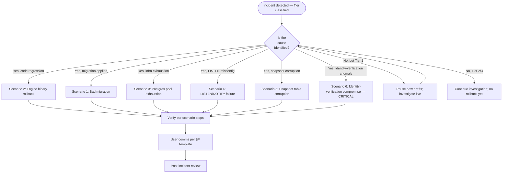

# Draft Engine — Rollback Playbook

> **Status:** post-11g.9 rollback paths only. Pre-11g.9 paths (pgmq
> queue, Edge Function) are permanently unavailable.
> **Audience:** solo on-call (today: Garrett). The single document
> the on-call reaches for to decide WHETHER to roll back and HOW.
> **Companion docs:**
> - [`README.md`](./README.md) — which runbook for which situation.
> - [`draft-engine-v2-operations.md`](./draft-engine-v2-operations.md) — incident response (triage → this playbook for rollback decision).
> - [`draft-engine-v2-staging-preflight.md`](./draft-engine-v2-staging-preflight.md) — pre-deploy verification (gates rollback dry-runs).
> - [`draft-engine-v2-known-issues.md`](./draft-engine-v2-known-issues.md) — recurring quirks.

---

## ⚠ No legacy path

**Anyone reaching for `pgmq`, the `draft-autopick` Edge Function, the
`draft_deadline_sweep` pg_cron job, or any pre-Phase-4.5 autopick
machinery during a rollback is wrong.** These were
DROP EXTENSION CASCADE'd in chunk 11g.9 (commit `9f72fd8`,
2026-05-12) — irreversible. They do not exist.

The persistent in-server engine (chunks 11g.0–11g.9) owns:
- The full hot path (manual picks, broadcasts, autopick).
- Recovery via event-log replay + snapshot+delta bootstrap.
- Cross-process signaling via Postgres LISTEN/NOTIFY.

Rollback paths below are the ONLY rollback paths. If a scenario you're
facing doesn't fit any of the six below, document it as a net-new KI
and escalate to Garrett before attempting freelance rollback.

---

## §1 Snapshot version compatibility marker

`ENGINE_SNAPSHOT_VERSION` constant in
`server/src/draft/snapshotPersistence.ts` is the rollback compatibility
marker. Current value: **`1`**.

- **Rolling back to a SHA with the same `ENGINE_SNAPSHOT_VERSION`:**
  snapshots from the newer code are readable by the older code. Safe.
- **Rolling back across a version bump:** newer snapshots will fail
  validation on read → engine auto-falls-back to canonical
  event-log replay. Safe; expect a flurry of
  `snapshot.bootstrap.fallback_full_replay` (warn) for the first few
  hours post-rollback, then steady-state once new snapshots are
  written at the older version. Slower bootstrap during transition;
  no data loss.
- **Schema-migration rollback that reverts engine SHA but leaves a
  forward-migrated schema:** **dangerous.** Engine may bootstrap
  against a schema it doesn't understand. Always sequence schema
  rollback BEFORE engine SHA rollback (or in the same atomic step).
  See scenario #1.

The marker is bumped per the rules in
`draft-engine-v2-operations.md` §6.1. Future bumps add risk to
rollbacks crossing the bump boundary — document each bump in the
project's Decision Log.

---

## §2 Decision-time framework

```
detect ──► decide path within N min ──► execute ──► verify ──► user comms ──► PIR
                       │
                       ├── Tier 1 (active high-stakes drafts): N = 5 min
                       ├── Tier 2 (active low-stakes drafts):  N = 15 min
                       └── Tier 3 (no active drafts):          N = at next deploy window
```

Tier definitions live in `draft-engine-v2-operations.md` §7.

The decision tree:



**Tier-1 default posture:** rollback IS on the table within 5 minutes
of detection. Default to "pause new drafts via discovery flag" as a
bridging action; choose the specific scenario once root cause is
identifiable.

---

## §3 Common pre-rollback bridging action: pause new drafts

For any Tier 1 incident where the cause isn't immediately identifiable,
this is the first move: keep existing drafts running (they have
durable state in `draft_events` and snapshots) but block new draft
creation while you investigate or roll back.

```bash
# TODO(10b/10c): document the discovery-flag mechanism for "no new
# drafts" once 10b lands. Until then, the manual pause path is:
#   - Set leagues.draft_state = 'paused' for any league where new
#     drafts should be blocked.
# Or, via SQL gating on the discovery endpoint:
psql "$SUPABASE_DB_URL" -c "
  -- Replace with the actual discovery-flag mechanism once defined.
  SELECT 'discovery flag TODO(10b)' AS reminder;
"
```

This is bridging — buys time, doesn't fix root cause. Move to the
appropriate scenario once cause is identifiable.

---

## §3.5 When rollback execution itself fails

After 10 minutes of executing a scenario's rollback path without
resolution, the situation has escalated. The on-call must:

1. **STOP the current rollback attempt mid-stream.** Don't compound.
   A half-applied rollback is often worse than the original incident
   — at minimum, it produces a state the runbook doesn't anticipate.

2. **Pause new drafts via discovery flag (§3) if not already done.**
   Stop adding load and adding users to the affected surface.

3. **Pause all in-progress drafts** via `draft_pause` /
   `auction_pause_v2`. At this point the incident has crossed from
   "we have a plan" to "we're improvising." Pause buys you the time
   to think without users feeling the improvisation.

4. **Reassess: is the original scenario classification still correct,
   or has new information surfaced?** Symptom and cause are not the
   same thing. A failed rollback often reveals that the cause was
   misidentified.

5. **Decide one of three paths:**
   - **Try a different scenario.** If reassessment indicates a
     different root cause (e.g., scenario 2 engine binary rollback
     failed because the actual issue is scenario 5 snapshot
     corruption), abandon the current scenario and execute the
     correct one from a clean state.
   - **Roll forward instead.** If the rollback target is also broken
     or unavailable (e.g., previous SHA had its own bug; prior
     migration also corrupts state), commit to fix-forward — but
     pause active drafts and post §F.4 catastrophic-outage comms
     first. Fix-forward under time pressure with users live is a
     worse outcome than fix-forward under user-comms cover.
   - **Full draft-engine downtime.** If neither rollback nor forward
     path is viable, stop the engine entirely, post §F.4 comms, and
     work the recovery without the time pressure of live drafts.
     `draft_events` is durable; the engine can be off for hours and
     users will lose UX but not state.

6. **Update user comms immediately — silent extended outages destroy
   trust.** Switch to §F.4 catastrophic outage template if not already
   on it. The transition from §F.1/§F.2/§F.3 to §F.4 is a signal to
   users that the response posture has shifted; making the shift
   explicit is the right move.

7. **Document the rollback-failure path in the PIR (§G).** Add a new
   question to the PIR: "Why did the first rollback path fail?
   Was the initial scenario classification wrong, was the rollback
   procedure incomplete, or was the rollback target itself broken?"
   This is one of the most diagnostic questions for runbook
   improvement.

The 10-minute trigger is intentional. Tier 1's 5-minute decision-time
target is for the initial scenario selection. The 10-minute mark
gives you a full second 5-minute window to attempt execution. If
execution hasn't converged by then, the situation has changed shape
and the response should change with it.

---

## §4 Scenarios

### Scenario 1 — Bad migration applied

- **Trigger / detection.** A migration was applied (to staging or
  production); engine fails to bootstrap, or RPCs return errors
  consistent with schema drift, or queries the engine runs fail with
  `column "X" does not exist` / `relation "Y" does not exist`.
- **Decision-time target.** Tier 1: 5 min. Tier 2: 15 min.
- **Rollback path.**
  1. **Identify the migration** — the most-recent file in
     `supabase/migrations/` matching the time window:
     ```bash
     cd /c/Users/garre/Documents/citrus-league-storm-phase45 && \
     ls -lt supabase/migrations/ | head -5
     ```
  2. **Check whether the migration has a documented down-script.**
     Citrus migrations are forward-only by default; a true down-script
     may not exist. If absent, the rollback is "write a corrective
     migration" — fix-forward, not revert.
  3. **If down-script exists:** apply it, then restart engine.
  4. **If no down-script exists,** a migration is "obviously revertable"
     only if ALL of the following are true:
     - The migration adds/drops a single column, constraint, index, or
       RPC parameter — not multiple changes, not table renames, not data
       migrations.
     - No production data has been migrated as a result of the change
       (i.e., no UPDATE/INSERT/DELETE in the migration body).
     - You can write the corrective DDL in under 5 lines without
       reference material.

     If ALL three: write the corrective migration; apply; restart engine.
     If ANY fail: skip to step 5 (fix-forward, not roll-back).
  5. **If the bad migration is large, complex, or has produced data
     changes:** pause new drafts (§3); pause active drafts
     (`draft_pause` per affected league); fix forward with care.
     Roll-forward, not roll-back.
  6. **CRITICAL:** never roll back the engine SHA while leaving a
     forward-migrated schema. Schema state and engine code must be
     compatible. Always sequence: schema rollback first, then engine
     SHA rollback (if both are needed).
- **Verification.** Engine bootstraps cleanly; affected lobbies
  resume; RPC error rate returns to baseline.
- **User communication.** Template "Investigating" (§F.1) at start;
  "Drafts paused, will resume" (§F.3) if rollback takes > 5 min for
  Tier 1; "Rolling back" (§F.2) once the corrective migration is in
  flight.
- **PIR checklist.**
  1. Why didn't the migration's staging preflight catch this?
  2. What was missing from the migration review?
  3. Is the fix in this scenario itself a roll-forward or true rollback?
  4. What new check should the staging-preflight runbook add?
  5. Should the migration framework gain a mandatory down-script policy?

### Scenario 2 — Engine binary regression

- **Trigger / detection.** A deploy ships a new SHA; some failure mode
  is reproducibly attributable to that deploy (Mandate breach,
  RPC errors, state-machine bug surfaced in a specific lobby).
- **Decision-time target.** Tier 1: 5 min. Tier 2: 15 min.
- **Rollback path.**
  1. **Identify the prior SHA.** `git log --oneline -5` on
     `phase-4-5-implementation` (current production branch). The
     SHA before the bad deploy is the rollback target.
  2. **Check `ENGINE_SNAPSHOT_VERSION` between prior SHA and current:**
     ```bash
     git show <prior-sha>:server/src/draft/snapshotPersistence.ts | grep ENGINE_SNAPSHOT_VERSION
     git show HEAD:server/src/draft/snapshotPersistence.ts | grep ENGINE_SNAPSHOT_VERSION
     ```
     - Same version: clean rollback. Snapshots are mutually readable.
     - Bumped: rollback crosses a version boundary. Newer snapshots
       will fail validation; engine auto-falls-back to event-replay
       (canonical). Slower bootstrap but correct.
  3. **Check for schema migrations between prior SHA and current:**
     ```bash
     git log --oneline <prior-sha>..HEAD -- supabase/migrations/
     ```
     - If migrations exist, see scenario #1 sequencing rule (schema
       rollback first if both are reverting).
  4. **Build + redeploy the prior SHA.** TODO(10b): document the
     standard build + GCE deploy pipeline for the engine. Until then,
     manual rebuild on the VM via `git checkout <sha> && npm ci &&
     npm run build:server && sudo systemctl restart citrus-draft-engine`.
  5. **Watch engine startup logs** for the §3 baseline sequence
     (`hono.listening`, `uws.listening`,
     `event_subscription.started`, `event_subscription.self_test_succeeded`).
- **Verification.** Engine running prior SHA; bootstrap succeeded for
  all previously-active lobbies; Mandate targets back in healthy
  range; error rates back to baseline.
- **User communication.** "Rolling back" (§F.2) at start; "Resumed /
  all-clear" (§F.5) in a final update once verification clears.
- **PIR checklist.**
  1. What test should have caught this regression pre-deploy?
  2. Was the bad SHA detectable by `draft-engine-v2-staging-preflight.md`
     checks?
  3. Should we add a new check to the preflight runbook?
  4. Did the regression involve `ENGINE_SNAPSHOT_VERSION` semantics
     that the bump rules failed to address?

### Scenario 3 — Postgres connection pool exhaustion

- **Trigger / detection.** Engine logs show repeated connection errors
  to Postgres; RPCs time out; new connections fail with
  `remaining connection slots reserved` or similar Postgres errors.
  HTTP routes and engine in-process Postgres calls both affected.
- **Decision-time target.** Tier 1: 5 min. Tier 2: 15 min.
- **Rollback path.**
  1. **Identify the cause.** Is this (a) sudden load spike (more
     active drafts than expected), (b) connection leak in engine
     code (recently-deployed regression), or (c) something else
     consuming connections (other services, leaked Supabase
     Dashboard sessions, etc.)?
  2. **For (a) load spike:** scale Supabase connection pool size in
     Supabase Dashboard → Settings → Database → Pool size. Bridging.
  3. **For (b) connection leak:** invoke scenario #2 (engine binary
     rollback) — the leak is in the deployed code.
  4. **For (c) external:** identify consumer; revoke / disconnect.
  5. **Bridging action while diagnosing:** pause new drafts (§3) to
     stop adding load.
- **Verification.** `psql "$SUPABASE_DB_URL" -c "SELECT count(*) FROM pg_stat_activity;"`
  shows healthy connection count; engine logs no longer show
  connection errors.
- **User communication.** "Investigating" (§F.1); upgrade to
  "Drafts paused, will resume" (§F.3) if bridging holds > 5 min for
  Tier 1.
- **PIR checklist.**
  1. What's the current pool size and what's the headroom?
  2. Should pool size scale automatically with active-draft count?
  3. Was there a load test that should have surfaced this? (11g.11
     scope.)
  4. If connection leak: what code change introduced it? Add a
     unit test that would have caught it.

### Scenario 4 — LISTEN/NOTIFY misconfiguration post-deploy

- **Trigger / detection.** Engine logs at startup show
  `event_subscription.self_test_failed` (error) with explicit operator
  hint about `SUPABASE_DB_URL`. OR: cross-process events (commissioner
  pause/resume/override/extend via the main API) are invisible to the
  engine — engine state doesn't reflect them until a client WS
  reconnect triggers bootstrap.
- **Decision-time target.** Tier 2 (no Tier 1 impact unless commish
  is mid-incident); 15 min.
- **Rollback path.**
  1. **Verify `SUPABASE_DB_URL` is direct** (per
     `draft-engine-v2-staging-preflight.md` §3.4): host
     `db.<project>.supabase.co`, port `5432`, NOT `pooler.supabase.com`
     and NOT port `6543`.
  2. **If pooled URL is in the env:** correct it, restart engine,
     watch for `event_subscription.self_test_succeeded` within 5s.
  3. **If direct URL is correct but self-test still fails:** check
     `event_subscription.client_error` log lines for connection-level
     details (network ACL, IP allowlist, Postgres connection limit).
  4. **If runtime `event_subscription.connection_lost` is frequent
     post-deploy (not just startup):** intermittent connectivity.
     Bootstrap is the correctness foundation — missed notifications
     during backoff are caught at next WS reconnect. Acceptable
     short-term; investigate root cause in non-emergency window.
- **Verification.** `event_subscription.self_test_succeeded` at
  startup; trigger a test RPC (`draft_pause` against a staging league)
  and verify `event_subscription.notification_received` +
  `event_subscription.event_applied` fire within 2s.
- **User communication.** Generally invisible to users (bootstrap
  covers correctness on next reconnect). Only post comms if commish
  actions are being lost in a high-visibility league. Template:
  "Investigating" (§F.1).
- **PIR checklist.**
  1. How did the misconfigured env make it to deploy?
  2. Should the deploy pipeline assert direct-URL pattern in the env?
  3. Did the self-test fire fast enough? Should the timeout shrink
     from 5s to 2s?

### Scenario 5 — Snapshot table corruption

> **Severity escalation:** if investigation reveals that `draft_events`
> (not just `draft_snapshots`) is the corrupted table, this is no longer
> Tier 2. Treat as Tier 1 + scenario 6 user-comms posture (§F.4
> Catastrophic outage). `draft_events` is the source of truth; its
> corruption is catastrophic.

- **Trigger / detection.** `snapshot.bootstrap.fallback_full_replay`
  (warn) fires for EVERY lobby (not just lobbies with missing
  snapshots), AND fallback rate doesn't drop after the first wave
  of fresh snapshots is written. May surface as slow bootstrap
  times after engine restart.
- **Decision-time target.** Tier 2: 15 min. (Auto-recovery via full
  event-replay is the correctness foundation; the symptom is slower
  bootstrap, not data loss.)
- **Rollback path.**
  1. **Confirm the symptom is corruption, not a version-bump
     transient.** Check `ENGINE_SNAPSHOT_VERSION` git history for any
     recent bump; if bump happened, this is expected behavior, NOT
     corruption.
  2. **If genuine corruption:** the canonical path is to truncate
     `draft_snapshots` and let the engine rebuild snapshots from
     scratch as drafts proceed:
     ```sql
     -- DESTRUCTIVE — confirms there is NO data loss because
     -- draft_events is the source of truth and snapshots are
     -- derived. But verify draft_events integrity FIRST:
     BEGIN;
     SELECT count(*) FROM draft_events;
     SELECT count(*) FROM draft_snapshots;
     -- If draft_events count is sane:
     -- TRUNCATE draft_snapshots;
     ROLLBACK; -- inspect before COMMIT
     ```
  3. **If `draft_events` ALSO appears corrupted:** this is
     catastrophic (event log is the source of truth). Escalate
     immediately; use scenario #6 user-comms posture (full
     transparency, no ETA). Supabase Point-in-Time Recovery may be
     the path. Notify Garrett immediately if not already on it.
- **Verification.** Engine bootstrap completes cleanly for all active
  lobbies (no `fallback_full_replay` for newly-rebuilt snapshots).
- **User communication.** Generally invisible. If catastrophic
  (event log corruption), template §F.4.
- **PIR checklist.**
  1. What caused the corruption? (Manual SQL? Migration bug?)
  2. Should `draft_snapshots` writes have an integrity check?
  3. Should `ENGINE_SNAPSHOT_VERSION` bump rules be tightened?
  4. Is there a backup-and-restore path for `draft_snapshots`
     that's lighter than truncate + rebuild?

### Scenario 6 — Engine identity-verification compromise (CRITICAL — security)

- **Trigger / detection.** Engine logs per ADR-004 §6 audit trail show
  picks submitted with verified `userId` that doesn't match the team
  owner (`teams.owner_id`), OR with `actor.kind` inconsistent with
  the manual/autopick path's expected pattern. Surfaces as user
  complaints ("someone else drafted on my team") confirmed by engine
  logs.
- **Decision-time target.** **IMMEDIATE.** This is a security incident,
  not just an ops issue. Move within 60 seconds of detection.
- **Rollback path.**
  1. **STOP ALL DRAFTS.** Pause via discovery flag (§3) AND pause every
     in-progress draft via `draft_pause` / `auction_pause_v2`:
     ```sql
     SELECT public.draft_pause(id, jsonb_build_object('kind', 'commissioner',
                                                       'id', '<garrett-user-id>'::uuid))
       FROM leagues WHERE draft_state = 'in_progress';
     ```
     Better to inconvenience every user than to commit more bad picks.
  2. **Pull the audit trail (ADR-004 §6):**
     ```sql
     SELECT seq, event_type, actor, payload->>'team_id' AS team_id,
            payload->>'idempotency_key' AS idempotency_key,
            created_at
       FROM draft_events
      WHERE event_type IN ('pick_submitted', 'auction_bid_placed')
        AND created_at > now() - interval '24 hours'
      ORDER BY seq DESC;
     ```
  3. **Identify scope of compromise.** For each suspect event, compare
     `actor.id` (verified userId) against expected
     `teams.owner_id` for the `payload.team_id`. Any mismatch is a
     bad pick. Record `seq` values for all bad picks.
  4. **Identify root cause.** Most likely sites:
     - Chunk 11g.2 step 2 `verifyDraftToken` (JWT validation).
     - Chunk 11g.6 team-authorization verification per ADR-004 §5.3.
     - Discovery endpoint draft-token issuance.
     Pull recent commits in `server/src/draft/` and review any
     identity-verification touch points.
  5. **Ship a fix** (engine SHA rollback per scenario #2 IF the
     compromise is attributable to a specific deploy; otherwise
     fix-forward with care).
  6. **Reverse affected picks.** Use `commissioner_override` events
     to manually undo bad picks (ADR-002 §3 6c4
     `overrideAction = 'undo_pick'`). Per ADR-002 polymorphism rule,
     single event type with discriminator.
  7. **Resume drafts** only after all known bad picks are reversed
     AND root cause is verified fixed.
- **Verification.**
  - Engine restart: identity-verification code path now
    refuses to call `submit_pick_v2` when verification fails.
  - Audit query (step 2 above) shows no new `actor.id` ↔ team-owner
    mismatches in subsequent picks.
  - Affected users confirm their teams' rosters are correct.
- **User communication.** Template §F.4 ("Catastrophic outage" — full
  transparency, no ETA). Adapt to security-incident wording: be
  explicit about the integrity issue, what was affected, what was
  fixed, what users should check on their teams.
- **PIR checklist.**
  1. What was the identity-verification bug? Document the exact
     code path.
  2. What test should have caught this? Write the test.
  3. Was the audit trail (ADR-004 §6) sufficient to identify all
     affected picks? If not, what additional logging is needed?
  4. **Disclosure framework:** what's our internal-vs-external
     disclosure posture for security incidents? (Reserved as
     deferred — needs product judgment beyond ops.)
  5. Does this incident require notifying impacted users individually?
     (Likely yes if any pick mismatch occurred in a $-stakes league.)
  6. Should ADR-004 §6 audit logging be extended (e.g., include
     IP address, draft-token issuance origin)?

---

## §F User-facing communication templates

Five templates below — starting points only. The on-call adapts
wording to the specific incident. Goal: remove "what do I say" as a
decision under pressure.

### §F.1 "Investigating" (first 30 seconds)

```
We're investigating a draft issue affecting [SCOPE: league name / all
active drafts / specific format]. We'll post updates as we learn more.
If your draft is in progress, please leave the tab open — we'll resync
automatically once the issue is resolved. Estimated time to next update:
5 minutes.
```

**When to use:** moment of detection. Commits to nothing other than
"we're on it" and a next-update cadence. Use Discord pinned message,
in-app banner, or whatever Citrus's user-comms channel is.

### §F.2 "Rolling back" (informed users, ETA window)

```
We're rolling back a recent change that caused [BRIEF DESCRIPTION:
slower picks / occasional disconnects / specific symptom]. Active drafts
are paused during the rollback and will resume automatically within
~5 minutes. No picks have been lost. Apologies for the disruption.
```

**When to use:** after the decision to roll back has been made; users
deserve to know what's happening. Adapt the symptom description to
the user-visible issue (not the technical cause).

### §F.3 "Drafts paused, will resume" (specific scope, specific resume time)

```
Drafts are paused due to [BRIEF DESCRIPTION]. We're working on it.
Specifically:
- [LEAGUE NAME / NUMBER OF AFFECTED LEAGUES] are paused.
- No picks have been lost.
- Estimated resume time: [TIME, e.g., "10:35pm Mountain / 12:35am Eastern / 9:35pm Pacific"].
We'll send a follow-up when drafts are running again.
```

**When to use:** bridging during longer rollback or fix-forward work.
Setting a specific resume time creates accountability; revise the
time forward if the work takes longer rather than letting the original
estimate silently expire.

**Timezone note:** Citrus serves North American users across multiple
timezones. State the time in at least three of the four major North
American timezones (Eastern / Central / Mountain / Pacific), OR if your
user-comms surface supports it, use a `[TIMESTAMP]` placeholder that
renders in each user's local timezone.

### §F.4 "Catastrophic outage" (full transparency, no ETA, commitment to update cadence)

```
We're experiencing a serious issue with [SCOPE: live drafts /
[specific issue, e.g., "draft state integrity"]]. We do not yet have
an ETA for resolution. What we know:
- [WHAT IS BROKEN]
- [WHAT IS NOT AFFECTED, e.g., "rosters and league standings are unaffected"]
- [WHAT USERS SHOULD/SHOULDN'T DO]
We'll post an update at least every 30 minutes until resolved,
regardless of whether there's new information. For incidents lasting
more than 2 hours, cadence relaxes to hourly. We'll post a full
incident report within 48 hours of resolution.
```

**When to use:**
- Scenario #5 with `draft_events` corruption.
- Scenario #6 (security — identity-verification compromise).
- Any incident lasting > 30 minutes without identified path forward.

Full transparency in catastrophic situations is a long-term reputation
investment. The instinct to under-promise wears poorly; users tolerate
honest "we don't know yet" better than vague "working on it."

**Cadence rationale:** solo on-call cannot reliably honor a 15-minute
update cadence while also fixing the incident — every 15 minutes
spent drafting an update is 15 minutes not spent on the cause. Commit
to a cadence you can hit (30 min initial, hourly after 2h). Missing
a committed update is worse than committing to a longer interval.

For security incidents (scenario #6), adapt:
- Be explicit that there was an integrity issue.
- State what users should verify on their own accounts.
- Commit to individual notifications for impacted users if applicable.

### §F.5 "Resumed / all-clear" (incident closed)

```
Drafts are resumed. The earlier issue [BRIEF DESCRIPTION] is resolved.
What happened (short version): [1-2 sentence cause].
What we did: [1-2 sentence fix].
What's confirmed working: [specific verifications, e.g., "all picks since
[time] have committed correctly", "no picks were lost"].
A full incident report will be posted within 48 hours. Thanks for your
patience.
```

**When to use:** every incident ends with one. Sent after verification
clears in any scenario. This is the most-frequently-needed template;
don't skip it. The "what we did" sentence is what users remember; keep
it short, honest, and free of jargon.

---

## §G Post-incident review (PIR) framework

After any rollback execution, within 48 hours:

1. **Timeline** — detection → decision → execution → verification →
   resolution. Capture timestamps.
2. **Root cause** — the actual technical cause, not just the symptom.
3. **Why didn't tests/preflight catch this?** — the gap that allowed
   the incident.
4. **What's the new check?** — a concrete addition to the
   staging-preflight runbook OR a new test in the relevant test suite.
5. **Customer impact** — affected users, picks lost (always zero in
   the post-11g.9 architecture if `draft_events` is intact), trust
   impact.
6. **Process learnings** — anything about the response itself that
   should change.

PIR doc lives at `docs/postmortems/YYYY-MM-DD-<incident-name>.md`.
TODO(deferred): create the `docs/postmortems/` directory + template
in a follow-up commit (out of 10e scope).
