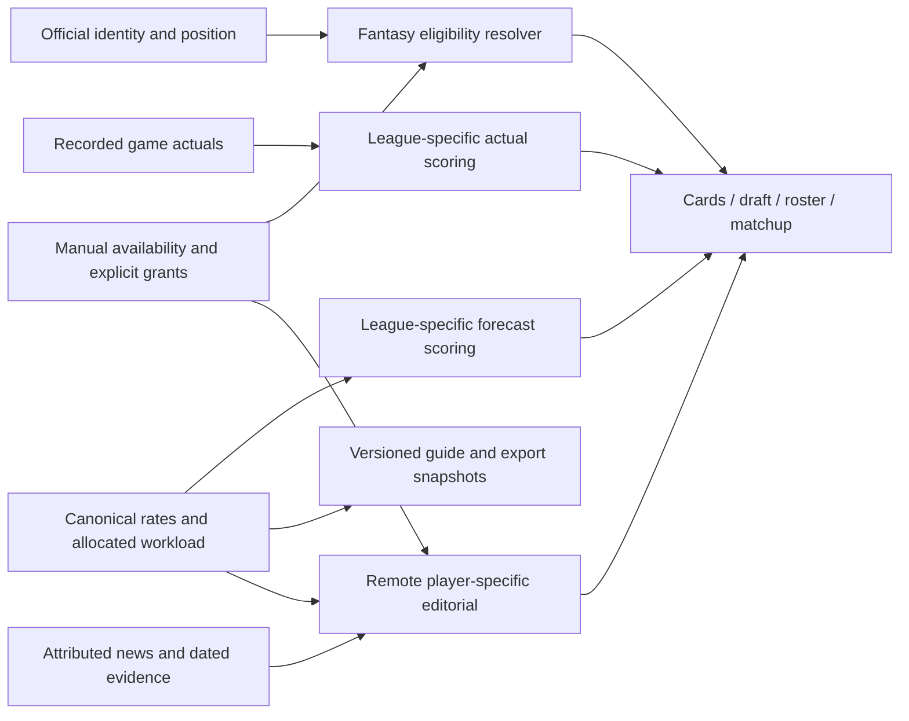

# Citrus mission and handoff — 14 September 2026

As of 2026-09-14T03:16:42.693317+00:00, the canonical publication and original rookie cohort are verified, PRs 492/493 are deployed, and native Build 20 is uploaded. Matchup reads now overlap safely; production timing gains are mixed, and Roster's app timestamps expose browser-driver overhead. Position policy, refreshed export eligibility, news freshness and unlocked-device QA retain the specific limitations below. Code revision: `e39d680619c45d290d95e535366ff21d2e231459`; this document is preserved separately on `codex/citrus-mission-handoff`.

## Mission and acceptance boundaries

Citrus should carry one governed forecast source through player cards, draft tools, league views, newsroom assessments, guides and exports. Official identity, fantasy eligibility, forecast role and allocated workload are separate facts. League scoring converts the forecast into that league's values; it must not silently replace the underlying forecast. Editorial assessments should reflect the individual player's supplied evidence, season and scoring context. Shared phrasing is possible; universal textual uniqueness is not an acceptance requirement.

Preserve actual results separately from forecasts, meaningful zero and negative values, goalie exposure weighting exactly once, the MODEL83 ceiling and 84-game schedule semantics, current injury evidence and IR ownership rules. Historical saved rosters, live corrections, and league/week/day/full-week cancellation boundaries remain correctness requirements during performance work. No competitive roster, ownership, pick, trade or settings changes were authorized by the loading audit.

The intended source-to-screen contract is:



This diagram is the governing contract, not proof of complete consumer parity. Verified bindings and known snapshot/feed limitations are recorded below. Eligibility and availability must not silently become projected workload; forecasts must not become recorded actuals.

This document distinguishes shipped behavior from local tests, unresolved work and user decisions. It is a dated handoff, not a claim that all surfaces are fresh or that performance is solved.

## SHIPPED — publication and coverage

Read-only production verification at 02:34–02:37 UTC found:

| Item | Verified value |
|---|---|
| Canonical runtime revision | `62cec404ab659c1f76bde96f25f4f611d2c20d5bef8f7f6804d7ad08645ea07d` |
| Canonical run | `7aa6e362-6cee-4a37-914d-b04851fc712e` |
| Source revision | `1abb5e7e638af27f45e2c522eb096a5f8c787410483d06d049f6da14cf1cdf4b` |
| Source run | `9e51ca51-331b-4310-8ffe-aa0c7e6cc7f2` |
| Last refresh | Successful, 13 September 23:19:18 UTC; no recorded error |
| Published contexts / ROS rows | 1,344 / 705; zero ROS run/revision stamp mismatches |
| Original rookie cohort | All 69 identities matched: 49 allocated, 20 conditional rates only, zero missing |

Conditional rates do not establish NHL games, starts or allocated workload. The guide's 24 individual rookie cards and 45 named Tier 5 members make up the 69-person cohort; these are different populations from the complete published context count. Identity checks used recorded IDs and exact names with documented Silayev/Silaev and Yegor/Egor Surin aliases, rather than fuzzy automatic matching.

Evidence: `outputs/loading-phases/mission-facts.json` in the loading checkout, with SELECT provenance and artifact hashes. The original cohort and identity receipts are under `/Users/gstorms/.codex/worktrees/8265/citrus/output/rookie-cohort-20260913/`. These checks establish publication binding and coverage, not model accuracy, training-corpus size or exhaustive freshness across every consumer.

## TESTED LOCAL — guides and exports

The Default and Finalsz PDF, manifest and XLSX editions all match their six recorded SHA-256 hashes and the runtime/source revisions above. They are explicitly local **DRAFT scoring-review editions**, using their recorded league/default scoring hashes and remaining-season horizon. Exporting them was not a publication action.

Their eligibility snapshot predates Schwartz's restore-feed event and still records LW. The artifacts are reproducible snapshots, but must not be presented as fully current eligibility. Rebuild and verify the affected eligibility fields before presenting refreshed editions; retain their publication and scoring bindings.

Receipt: `/Users/gstorms/.codex/worktrees/eligibility-propagation/citrus/output/eligibility-20260913/CURRENT-EXPORT-ACCEPTANCE.json`. Preserve the unrelated checkout `/Users/gstorms/dev/citrus`, verified on branch `draftkit/analytics-rescue`. Do not reset, clean or merge its WIP as part of loading work.

## SHIPPED — remote editorial; freshness limits retained

PRs 484/485 published evidence-based remote outlooks. After PR 488's prospect publication, generation workflow `34789911633` produced 1,344 outlooks with zero errors. Eight sampled API checks and the recorded browser card/desktop checks passed in their documented scopes. Player-specific arguments follow supplied rates, workload, season, availability and attributed news; repeated justified lower-tier conclusions remain possible. Text uniqueness is not evidence of quality or freshness.

The archived Build 18 fetches remote prose on next open/player change and has no held-open poll. Build 19/current web use a 60-second notes refresh; Build 20 retains that contract and includes PR 490's lower empty-state correction. Remote content updates do not replace bundled client code. No new device acceptance follows from those remote contracts.

The dated editorial receipt records ESPN 403, TSN 404 and The Hockey News 404 failures; Sportsnet, NHL, Daily Faceoff and Dobber remained usable. This loading pass did not establish that those failed feeds recovered or that every player has current news. Report date, original publication date and evaluation date must stay distinct. Evidence: `/Users/gstorms/.codex/worktrees/dynamic-outlook-editorial/citrus/outputs/editorial/PUBLICATION_RECEIPT.md` and `outputs/readiness/PROSPECT-PUBLICATION-RECEIPT.md` in the same checkout.

## User-maintained availability and fantasy IR policy

The user's explicit instruction makes **IR, LTIR, OUT and INJ eligible for fantasy IR slots**, including maintained owner inputs, subject to the league's IR capacity, ownership and normal locks. Healthy, unknown, DTD and suspended were not granted eligibility by that instruction. Do not replace this policy with contradictory older audit wording that treated OUT/INJ as ineligible.

The owner maintains injury status until a better source is available. Owner adoption is not independent medical verification. Review reminders do not themselves clear an active status; authoritative changes and explicit expiry semantics remain distinct. Current unknown evidence must not resurrect an old cached designation. Loading changes preserve these rules and do not add or remove an availability designation.

## SHIPPED / USER DECISION — position policy

NHL official data is the baseline. A forecast role is not a secondary fantasy-position grant. PR 491 (`c624988d`) added return-to-feed behavior that preserves event history and future NHL feed fallback. PR 492 reconciled the migration filename to the actual applied timestamp, `20260914010154_position_override_return_to_feed.sql`, without changing its SQL.

- **Schwartz: shipped.** Event `b917d5bb-91f6-4ba1-bedb-90f8ebc8a7d6`, recorded 14 September 01:02:10 UTC, restored official C. Forecast role LW remains separate. No secondary grant was made.
- **Zuccarello: user decision remains pending.** The raw official primary is C; the existing governed correction remains RW. A pre-existing RW roster slot is not permission to grant RW eligibility. The policy owner must resolve whether to restore official C with explicitly approved protected manual RW eligibility, or retain the current correction pending review.
- **Unresolved infrastructure:** protected manual-secondary storage/resolution, retained raw per-field provenance, and conflict/staleness monitoring remain gaps in the source-priority receipt. This pass did not exhaustively re-audit those mechanisms.

Policy owner task: `01a09434-4538-7dd2-a40e-0ed7204d9254`. Evidence: `SOURCE-PRIORITY-AUDIT-RECEIPT.json` beside the export receipt.

## SHIPPED — loading changes through PR 492

PR 492 merged as `7355483e80172e7bd42da2a3e10f68b7e7faae1f`. It removed Roster's full dashboard download for IR maintenance in favor of current evidence for its own player IDs, fixed the auth-pending demo load, overlapped safe transaction/canonical reads, and compressed the dashboard response without changing its decoded contract.

The scoped IR response transferred 26,013 bytes instead of the approximately 22.14 MB dashboard response. The compressed dashboard transferred 2,028,834 bytes and rendered successfully. Missing current IR evidence stays unknown rather than resurrecting a stale injury flag.

Production deployment `34796244160` succeeded. API revision: `citrus-api-00334-fhp`; image digest: `sha256:7ccde8625cdbd7c162ae20f63153bf64a6446074830a83ee181e2a6e1b48d9a9`; web bundle: `index-1eJqdoaN.js`. All 17 PR checks passed. Local suites passed: web 4,917, server 2,154 with six skips, shared 491, plus PGlite validation, build, types and lint.

Individual browser observations did **not** establish a general end-to-end speedup: warm Roster was 3.323 → 3.353 seconds, reload 2.300 → 1.498 seconds, Finalsz Matchup 5.017 → 5.054 seconds, and Test Matchup 5.055 → 5.372 seconds. Those observations measured visible lineups, not fully settled scores. Cache/server variability and browser-driver waits limit attribution.

Detailed evidence: [loading audit](2026-09-14-matchup-roster-loading.md) and `/Users/gstorms/.codex/worktrees/native-build20/citrus/outputs/performance-audit-20260914/POST_DEPLOY_ACCEPTANCE.json`.

## SHIPPED — scoped Matchup prefetch and page diagnostics

PR 493 merged as `e39d680619c45d290d95e535366ff21d2e231459` at 03:03:13 UTC after all 16 PR checks passed. Merged CI `34801249147` and the production gate also passed. Production deployment `34801249012` succeeded. API revision `citrus-api-00335-q8b` serves image `sha256:ffa8239572e57cf7f52df4ce5c0714ad992f99a9c100361a38e17e04a8f808e5`; browser acceptance verified `index-C9-3WjcU.js`. The implementation branch was `codex/matchup-loading-phases`; the handoff branch is `codex/citrus-mission-handoff`, in `/Users/gstorms/.codex/worktrees/matchup-loading-phases/citrus`. Its scoped Matchup prefetch begins today's projections after validated roster IDs are known; week stats, schedule and matchup lines begin after the existing league/week checks. Results are consumed at the original enrichment boundary only when normalized player/date/team/week scopes still match. A mismatch refetches. Captured failures retain their original error precedence. Historical target-date paths retain their existing enrichment boundary.

The saved-lineup reads remain ordered because they clear local storage. Ensure-rosters, roster/lineup construction, daily scoring/backfill/persistence, frozen roster recovery and missing-player recovery remain ordered. No scoring formula, publication policy, schema or server mutation changed in this slice.

Actual-service deterministic tests show 680 → 380 ms for the simulated enrichment path with exact full-result equality, including negative skater scores, zero goalie scores and exposure values. This is a scheduling fixture, not a production measurement. Scope omission, date rollover, optional/fatal read failures and earlier lineup failure are covered. The original four focused service/helper files passed 57 tests and web types. A further missing-lineup regression verifies identical save arguments, sequential saves, hydration after both saves, and full response parity; all seven enrichment tests pass. Full build, web suite (4,940 on the final merged-commit CI), server suite (2,154 plus six skips), shared suite (491), web/server types and lint passed. Independent review found no confirmed blocking defect.

Page diagnostics record anonymous DOM-only epoch timestamps. Data delivery/commit, first lineup commit, loader completion and an animation-frame callback are distinct markers. The frame callback does not prove pixels painted; loader completion does not establish that every ancillary projection or score request finished. Diagnostics introduce no telemetry, storage or request changes. Roster may restart its loader when the initial date resolves; use persistent `pageStart` or the browser navigation timestamp for the entire navigation, not only the final `loadStart`. Matchup measures its week loader; date-view effects remain outside that marker.

The same browser helper produced these individual desktop observations:

| View | Visible lineup, before → after | Observed settled page, before → after | API requests | Encoded bytes |
|---|---:|---:|---:|---:|
| Finalsz Matchup | 5.257 → 3.679 s | 6.830 → 5.292 s | 49 → 38 | 445,826 → 360,604 |
| Test night 9th Matchup | 4.204 → 3.942 s | 5.849 → 5.882 s | 46 → 46 | 638,656 → 638,621 |
| Finalsz Roster | 3.324 → 3.365 s | 4.168 → 4.274 s | 23 → 31 | 147,352 → 165,911 |

The settled marker requires a visible lineup, completion of relevant observed API requests, and a stable DOM for at least 500 ms. It includes observed score/projection work, but is not exhaustive live-game readiness proof. The driver awaits its click before polling; its visible-lineup time can overstate application delay. All post-deployment captures had no request errors. The baseline Roster included one HTTP 200 request subsequently aborted, not an HTTP failure.

The new app timestamps place first usable lineup commit at 3.504 seconds for Finalsz Matchup, 3.255 seconds for Test Matchup, and 1.659 seconds for Roster, measured from each page mount. Roster's 3.365-second driver observation therefore must not be attributed entirely to application loading. Its final date-specific loader started 1.372 seconds after page mount and completed approximately 0.28 seconds later. That initial interval includes preceding initialization/load work; the overwritten final-scope markers do not establish it was entirely authentication.

In the same 46-request Test comparison, today's projection request now begins alongside by-ID loading at 1.333 seconds relative to the first API request, versus 2.048 seconds previously. Daily scoring starts 392 ms earlier. Later server durations and the driver's page-mount offset vary, so the observed settled time remains essentially unchanged. Finalsz's larger gain also includes fewer requests and different cache/context timing; do not attribute the whole 1.54-second reduction to this code change. No Roster before/after gain is established.

Test league before/after decoded responses were exactly equal: 14 daily-score rows, 312 frozen-roster entries, and ensure-rosters reporting zero initialized rows. The UI retained the same weekly forecasts; full-week navigation and return to September 30 showed a 6.7-point player projection separately from 0.0 recorded points. These are future-week test views, not an in-game native or concurrency benchmark. Normal page endpoints may persist derived score/cache data; other internal mutation counts were not exposed. No competitive picks, trades, lineup, ownership or settings actions were invoked.

The first normal reload used the prior service-worker client; reopening after update discovery loaded the verified new bundle. New client diagnostics/prefetch are **not** in uploaded Build 20. Evidence: `/Users/gstorms/.codex/worktrees/matchup-loading-phases/citrus/outputs/loading-phases/POST_DEPLOY_ACCEPTANCE.json`, accompanying baseline/after JSON and DOM captures, and saved helper source. The production workflow and merged CI logs are retained in `/tmp/citrus-loading-deploy.log` and `/tmp/citrus-loading-merged-ci.log`; those temporary logs are supplementary, not the sole release receipt.

## REJECTED — unsafe server overlap

The exploratory branch `codex/matchup-backfill-overlap` in `/Users/gstorms/.codex/worktrees/matchup-backfill-overlap/citrus` is intentionally uncommitted and unshipped. Its 102 focused tests include a non-equivalence reproduction: if a roster row is deleted while the lineup read waits, an early existence snapshot can skip a row that the serial path would reconstruct. That changes persisted state.

Do not revive that overlap merely to remove a browser wait. Any server consolidation must preserve sequential maintenance semantics and add proper user-scoped league authorization. A sequential aggregate endpoint might remove one transport round trip, but has not been implemented or measured. See `outputs/backfill-overlap-review/NOT-READY.md` in that checkout.

## UPLOADED — native Build 20; device QA unresolved

Build 20 is uploaded and preserved. Do not rebuild/re-upload 20, create/upload 21, change Build 18's review selection or alter App Review without further user instruction.

| Item | Receipt |
|---|---|
| Source | Detached `7355483e80172e7bd42da2a3e10f68b7e7faae1f`, version 1.0 / build 20 |
| Exact uploaded IPA SHA-256 | `30981332ae0c3e06d5479673f1ddb068ebb1ddbc010089b926ad4b7fcc299f23` |
| Separately exported IPA SHA-256 | `d1d6bdf93a5052757001c803bc18579a2343a58cfd33b7518f7d4d239870a9c8` |
| Upload | Successful 14 September 01:47:49 UTC |
| ASC build ID | `4e90e6e4-0e7b-47af-8e10-6e4ccc398667` |
| ASC processing | Complete / Ready to Submit / Binary Validated |
| Signing | Apple Distribution, production APNs, get-task-allow false; associated domains verified |
| Device | Installed on iPhone Air; launch blocked because phone was locked (`FBSOpenApplicationErrorDomain 7`) |
| Review | Build 18 remained selected, Waiting for Review, manual release; no group/tester/review changes |

The separate IPA hashes reflect Xcode's upload repackaging; all 216 bundled assets matched. Installation and validation do not establish interactive device acceptance. New client changes after PR 492 require a future native binary and are not present in Build 20.

Preserved checkout: `/Users/gstorms/.codex/worktrees/native-build20/citrus`. Receipts under `outputs/native-build20/`: `VALIDATION.md`, `ACCEPTANCE.json`, `DEVICE-QA.md`, `review-state-after-upload.json`, `asc-build20-metadata.dom.txt`, actual `uploaded-App.ipa`, archive and export. Build 19's separate checkout `/Users/gstorms/.codex/worktrees/native-release-af576c3/citrus` also remains preserved.

## Next owner actions and reproduction

Root coordinator task: `01a0942d-e879-7c70-89a7-16cb6c840eac`. PR 493 is merged and its implementation branch retired. The tracked handoff is on `codex/citrus-mission-handoff`; source-policy decisions remain with the separate policy task.

1. For the next performance slice, target the remaining measured sequential work: daily scoring around 0.57–0.60 seconds, frozen-roster hydration around 0.70–0.74 seconds and missing-player recovery around 0.40–0.43 seconds in these captures. Preserve the rejected-race constraint above: consolidation needs an explicit concurrency/authorization contract. Repeat app-clock and settled-request measurement after any future change; do not restore stale caches to shorten the number.
2. Roster's measured app load is 1.659 seconds, with the final daily-roster read around 0.28 seconds and preceding initialization around 1.37 seconds. Preserve earlier scope-stage history if that initial interval needs finer attribution. Its warm schedule reads were approximately 1–3 ms; moving them would not explain the driver's additional delay.
3. Preserve required recovery projection batches: saved-roster recovery expands the ID set. Do not restore Build 18's date-only cache. Review elapsed-day actual-stat coverage for recovered IDs separately; the current stats scope does not include the player-ID set, and this audit has not established universal coverage.
4. Resolve the explicit position decision and manual-secondary/provenance gaps; regenerate exports with current eligibility and verify their manifests and league scoring before sharing refreshed editions.
5. Perform unlocked-device interactive QA when available and authorized. Request separate authorization for any future native binary or review action.

Required checks from the loading checkout, build first:

```sh
npm run build --workspace=apps/web
npm run test --workspace=apps/web
npm run test:server
npm run test:shared
npm exec --workspace=apps/web -- tsc --noEmit -p tsconfig.app.json
npm exec --workspace=server -- tsc --noEmit
npm exec --workspace=apps/web -- eslint src/
git diff --check
```

Focused replay: run Vitest from `apps/web` against `src/lib/__tests__/scopedRead.test.ts`, `src/services/__tests__/MatchupService.enrichmentOverlap.test.ts`, `src/services/__tests__/MatchupService.navigationOverlap.test.ts`, the load-timing hook tests and the existing matchup lifecycle tests. Browser helper and sanitized captures are saved in `outputs/loading-phases/`; no credentials belong in receipts.

Rollback for this client slice is a reviewed revert PR followed by the normal deployment pipeline; do not roll back projection publication, eligibility events or native review state with it. Use PR 493 merge SHA `e39d680619c45d290d95e535366ff21d2e231459` rather than reverting unrelated intervening work. PR 492's exact web/API artifacts above remain the comparison baseline. Neither this handoff nor its local fixture establishes fastest-possible loading, draft latency targets or universal production correctness.
