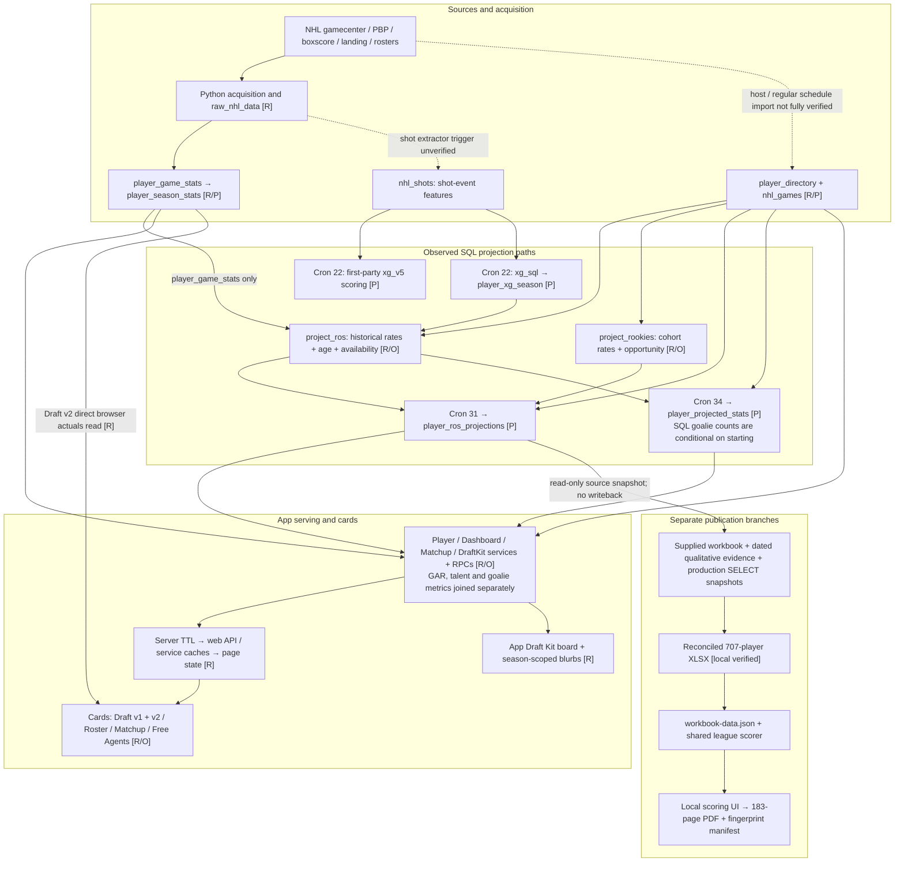
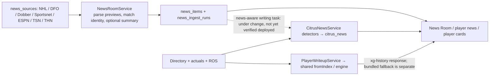

# Citrus: verified end-to-end data network

**Observed 12 September 2026.** This map shows where displayed data comes from, including paths that remain separate. It is not a deployment roadmap. The completed 707-player guide is preserved. This audit changes documentation and one diagnostic description only; it does not change production, jobs, schemas, projection algorithms or the App Store submission.

## Read the network

**P** means production definitions, job runs or rows were inspected directly by this audit's writer agent. **O** means production/archive evidence supplied by the reconciliation owner. **R** means an executable repository path was traced. Dashed arrows identify an unverified invocation or planned connection; they must not be read as established production data flow. A successful cron run does not prove every exception-catching substep succeeded.

The first-party `xg_v5` branch is deliberately not drawn into `player_xg_season` or ROS: the verified input on that route is `xg_sql`. Cron22 also calls strength, TOI, on-ice, GAR and goalie routines; their individual field dependencies are listed or marked unknown in the writer inventory, rather than inferred from call order. The inspected daily SQL reads `project_ros`, **not** the rookie union. Thus a rookie ROS forecast does not guarantee a daily row.

The dashed acquisition edges are genuine proof gaps. Python source code, an old runbook or a scheduler installer does not establish that a host is currently executing it. `main.yml` is now a **10:30 UTC read-only health check**, not a second projection writer.

## News and writing network

Current `CitrusNewsService` does not read `news_items`. Its stored notes, dynamically generated player-card prose, bundled fallback prose, third-party previews and `draft_kit_blurbs` are different data products. The separate editorial task owns the new news-grounded connection and writing differentiation. There is no established news/injury → projection-rate or availability edge in this audit.

## Target: one authoritative source

The user-required end state is one effective per-player/team rate, workload, override and provenance contract, with daily/weekly/season and every app/publication output derived from it. The current split network above has not yet converged. See the [target network, line-by-line acceptance ledger and required migration→cleanup sequence](lineage-convergence-2026-09-12.md). Implementation belongs to the reconciliation owner; reviewed retirement follows consumer proof.

## Detailed evidence inventory

| Inventory | What it resolves |
|---|---|
| [Sources, features, writers and jobs](lineage-writers-2026-09-12.md) | Exact raw sources, identity joins, actuals, two xG branches, SQL function inputs, current cron times, alternate writers, injury/news provenance; direct SELECT query appendix |
| [Services, caches and visible consumers](lineage-consumers-2026-09-12.md) | Draft v1/v2, roster, matchup, free agents, shared modal and app Draft Kit; actual versus ROS/daily values; API and direct-browser bypasses; source file/line references |
| [707-player workbook and PDF](lineage-draft-guide-2026-09-12.md) | Original workbook plus production snapshots and curated decisions → reconciled XLSX → immutable JSON → shared scorer → local UI/PDF; exact hash and source-exposure contract |
| [Cleanup dependency audit](lineage-cleanup-2026-09-12.md) | Active versus legacy/unknown candidates; exact callers and scheduler constraints; safe archive/retirement validation plan |

The inventories link executable source lines in the inspected worktrees. Baseline is `7990476d` on `codex/draft-guide-configurable`, built on `6aef8ab7`. Owner correctness work is in `51b2c3ae` and `1365b357` on `codex/projection-reconciliation`; subsequent edits are identified separately. Neither a local commit nor this diagram identifies the currently deployed API revision.

## What each displayed datum means

| Datum | Origin / unit | Required downstream interpretation |
|---|---|---|
| Player identity and club | `player_directory` for an explicit directory season; historical `nhl_player_identity` is a separate observed-history layer | Prefer NHL ID. Current club is not proof that past actuals belong to that club or season. Explicit aliases are reviewed, not fuzzy guesses. |
| Actual goals, assists, shots, hits, blocks, PIM, goalie appearances | Official boxscore/game records in `player_game_stats`; regular-season aggregation in `player_season_stats` | Carry the selected actual season. A database record count or dressed-game record is not an appearance. Zero and absence differ. |
| Expected-goals values | Precise fields matter: `nhl_shots.xg_v5` and `nhl_shots.xg_sql` are different branches; verified season aggregation uses `xg_sql` | Never relabel one model field as another, or imply the trained model described in an old document generated the displayed forecast. |
| ROS category totals | `project_ros` / `project_rookies` → `player_ros_projections`, with schedule and expected games/starts already applied | Score totals under league weights; divide by volume for a rate if needed. Do not apply games a second time or add another blanket 84/82 factor. |
| Daily SQL goalie categories | `player_projected_stats`, method `v2_rates_age_home_b2b`; conditional per-start categories on each team opportunity | Legacy `projected_gp=1` does not mean a goalie starts every game. New consumer must apply supported exposure once. |
| Python daily categories | Reachable alternative `probability_based_volume` writer | These counts already include probability. They cannot share the SQL interpretation or receive the same second multiplier. External execution remains unverified. |
| Expected goalie starts / probability | Local correctness endpoint derives supported shares from complete ROS crease allocation and remaining schedule | Additive metadata preserves old fields. Unknown evidence stays null; no arbitrary backup cap or fake confirmation. This is an offseason prior, not an announced starter feed. |
| Fantasy points and rank | Consumer-specific: shared category scorers, stored default totals, or curated workbook scorer | The presence of a shared scorer does not prove each surface calls it. Cache raw hockey data independently; derive league totals without mutating it. |
| Injury/status | ESPN injury importer with identity resolution and provenance; other manual/status inputs can coexist | The checked-in injury workflow is manual-only. Current status has an as-of time; its existence does not prove it conditions ROS GP. |
| Player prose | Dynamic server engine, bundled fallback, stored first-party notes, external previews and app Draft Kit blurbs | Carry actual season, projection season, publication/source time and uncertainty separately. Fixing a dynamic template does not rewrite stored prose or a submitted binary. |

## Populations and versions are separate

- Owner read-only production snapshot: **1,271 skaters + 157 goalies** in ROS; all **1,312 current-directory identities** have ROS. Historical identities can make ROS larger than the current directory. These are dated source-owner observations, not a fresh universal census.
- Final curated workbook: **618 skaters + 89 goalies = 707**, including retained manual decisions and 52 supported additions. It is not an automatic replacement for the live ROS table. Its fingerprint is `8beb3a8a86bf431a99f012cb4bf100db1d72362f835c3876cd5f343b3c33f7fc`.
- Source exposure differs within the workbook: original rows can contain season-count bases, while added rows use baseline1 rates. The guide normalizes only for display/scoring and preserves the underlying source fields. Three DEFAULT rows are cohort priors; unavailable probability is not assumed to be 100%.
- The original PDF's short board and the historical model-export subset are older editorial/export populations. Their counts do not establish live model coverage.

## Backend/client boundary

The reconciliation owner inspected the actual version1.0/build18 archive: it bundles client JavaScript and calls the hosted API. Backend changes cannot rewrite its labels, fallback prose, session caches or formulas.

| State | Consequence |
|---|---|
| Production SQL jobs and queried rows | Verified by the writer/owner evidence on the stated observation date. No write or deployment occurred in this audit. |
| Local correctness commits `51b2c3ae` / `1365b357` | Hero ROS selection, cache refresh, explicit source seasons, goalie exposure metadata and consumer changes are reviewable source changes. They are not claimed live. |
| Additive backend season/exposure fields | Existing build18 may receive and ignore them after fetching. Preserving shape does not mean it uses new semantics. |
| Corrected server-generated prose | Can reach compatible old clients after an authorized deployment/request; bundled fallback and labels remain separate. |
| Corrected native scoring/labels/cache behavior | Requires a newly bundled client, tracked as build19 work by the owner. No submission replacement or deployment is authorized by this map. |
| Ongoing editorial and direct-preload work | Separate owners; consumer inventory records the inspected commit versus later working-tree state. Recheck before calling those edges deployed. |

Owner evidence: [projection serving/archive audit](/Users/gstorms/.codex/worktrees/4304/citrus/docs/projection-live-release-notes-20260912.md), [weekly goalie writer/consumer audit](/Users/gstorms/.codex/worktrees/4304/citrus/docs/goalie-weekly-backend-audit-20260912.md), [correctness follow-up](/Users/gstorms/.codex/worktrees/4304/citrus/docs/projection-correctness-followup-20260912.md).

## Cleanup performed and remaining decisions

**Completed reversible cleanup:** corrected stale `main.yml`/Python ownership and historical scheduler claims in `DATA_INVENTORY.md`, `ENGINEERING.md` and `OPERATIONS.md`; corrected one diagnostic reason string in `check_serving_path_provenance.py`. The read-only provenance scanner passes. Historical code and incident evidence remain preserved. The guide code/data/artifacts are unchanged.

**Retain:** ROS and daily output tables, actual-season/game layers, identity/directory layers, editorial products and the offline workbook snapshot each have distinct demonstrated consumers or provenance purposes. Similar field names do not make them redundant.

**Reviewable retirement candidates:** the unwired `fantasy_projection_pipeline.py`, historical date-hardcoded operator wrappers, uncalled physical-cache helpers and `projection_cache` have documented local evidence. They are not yet proven free of external callers or current database dependencies. A table drop, truncate or writer disablement is not a safe synonym for tidying files.

Before any runtime retirement, collect deployed host task/service commands and recent runs, then current database function/view/trigger/foreign-key/grant/publication dependencies. Archive one proven local candidate per reversible change and run its affected contracts. Database retirement needs a concrete restore/compatibility plan and separate review; no `CASCADE` shortcut.

Open proof gaps: current regular-season schedule importer; current shot-extractor trigger; external Python/Windows invocation; deployed API commit; exact archive Git SHA; source-level outcomes behind caught SQL exceptions; complete advanced-metric field lineage; failed-news-feed causes. These are explicit unknown edges, not assumed dead silos.
