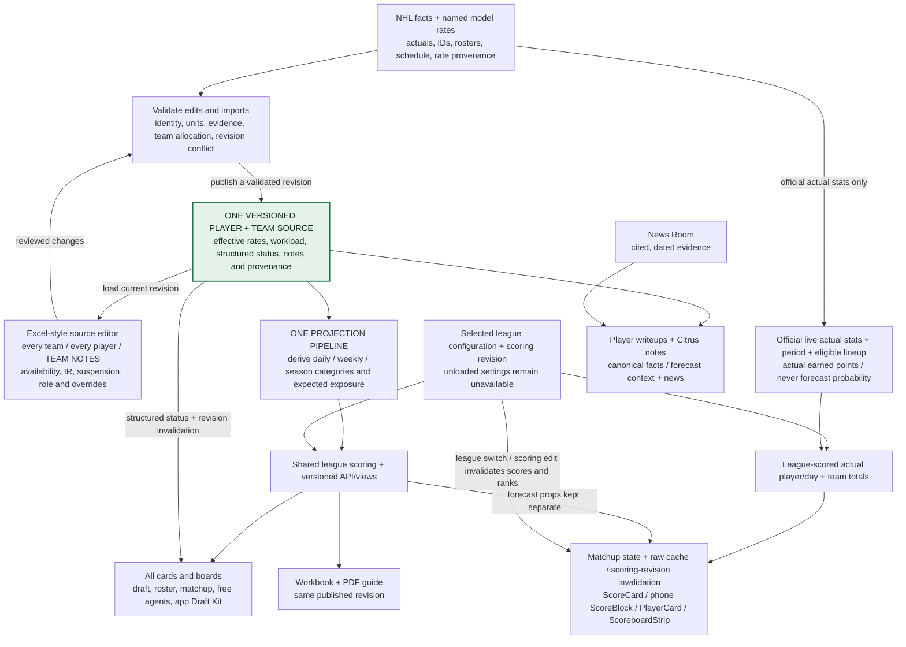

# One authoritative projection source: convergence and retirement

User-required end state, 12 September 2026: one reliable source for every player and team, with transparent rates, workload, overrides and provenance; daily, weekly, season, app and workbook outputs derive from it. This is the target and acceptance plan, not a claim the current split pipeline has converged. The current network and evidence are in [the lineage map](citrus-data-lineage-2026-09-12.md).

The reconciliation task owns implementation of the canonical contract and app/runtime adapters. The editorial task owns news-aware writing. This documentation task owns the map, dependency/lag inventory and nonoverlapping cleanup after migration is proven. The existing guide remains a versioned, reproducible delivered edition until a canonical replacement is verified.

## Target network

This is a **logical authority**, not a requirement to put all facts in one physical table. Separate immutable observations, reviewed decisions and derived materializations are compatible with one source if they share stable identity, versioned provenance and a single derivation contract. A second independent rate or availability formula hidden in an exporter, page or fallback is not.

A news article can support a dated decision; it must not silently become a numeric return date or start probability. Actual-stat truth remains separate from forecasts. A current team assignment cannot rewrite historical actuals. The selected model field/version must be explicit; the active `xg_v5` and `xg_sql` branches cannot be merged by renaming.

## Human source view and edit loop

The authoritative source must be inspectable and editable in an Excel-style team-by-team/player-by-player view, including TEAM NOTES. This view edits reviewed records through the same validation/activation contract; it is not an independent spreadsheet truth. A change carries the base revision, affected player/team IDs, fields, rationale and evidence. Validation rejects conflicting/stale revisions and unsupported identity or unit changes before activation.

Forecast coverage (`projected`, `rates_only`, `unresolved`) is distinct from health/availability status such as injured, IR or suspended. The latter must propagate to cards as structured data and to workload only through the reviewed availability policy. A status label alone must not invent a return date or silently zero a player’s season. Published revision changes invalidate or refresh all derived consumer caches according to the version contract.

The reconciliation owner is confirming human-editor ownership and the concrete import/activation interface. This task can provide the canonical review/export and guide adapter against that same interface; no parallel source will be introduced.

## Required logical contract

Concrete storage/API column mappings are owned by the reconciliation implementation; the entries below are semantic requirements, not an invented migration.

| Element | Required meaning / line-by-line check |
|---|---|
| Stable identity | NHL player ID, canonical display name, team/scenario affiliation and explicit unknown/unassigned state; no silent fuzzy join |
| Snapshot and temporal context | Actual-stat season, projection season, as-of/source time and projection snapshot/version independently carried to outputs |
| Rates | Named category values, denominator/exposure basis, model or manual source, model/version/input lineage; preserve raw source values as evidence |
| Workload | GP or starts with clear horizon and conditionality; injury absence, camp opportunity and scenario assumptions identified rather than hidden in a second multiplier |
| Roster probability | Explicit value and basis when supplied; blank means unknown. Record whether workload already includes it; never assume100% or apply twice |
| Team allocation | Schedule budget and complete goalie crease; distinguish team opportunities from player starts. Preserve competing skater scenarios and report over-allocation rather than silently forcing GP to fit |
| Effective overrides | Reviewed player/team role, injury or rate/workload exception, source URL/document, date, rationale, precedence, expiry/review condition and retained original |
| Derived counts | One derivation of rates × supported exposure for the selected day/week/season/scenario; conditional raw values may remain as compatibility fields with explicit units |
| Fantasy outputs | League/scoring identity, category contributions, total/per-unit points and ranks derived consistently; missing, valid zero and negative values remain distinct |
| Provenance and freshness | Source family, last successful materialization, stale/unknown flags and evidence of the writer; a current response time does not make an old input fresh |

Original workbook nominal scenarios and probability-adjusted scenarios are not interchangeable. If the canonical view exposes both, labels and identifiers must distinguish them. A cohort prior with already-unconditional GP cannot receive the old workbook's extra roster adjustment. The implementation must settle each row's basis before claiming numeric parity.

## Player and team acceptance ledger

Maintain one reviewable ledger/export keyed by player ID and projection snapshot, analogous to the reconciled workbook's Player Audit and Team Totals. Each row must show:

- Raw source rate/exposure and source season; effective rate and why it differs, if overridden.
- Workload, basis and roster/scenario treatment; final derived daily/weekly/ROS categories.
- Current team/role/status evidence and unresolved assumptions; coverage state for missing prospects.
- Same-snapshot app/API/workbook values under the same weights; numeric differences explained by horizon/scenario, not unnamed source divergence.
- Team crease conservation and scenario-aware skater capacity checks. Do not manufacture an exact injury return or edit rates to make totals look tidy.

Acceptance is not “all rows have a number.” It is “each row has a supported value or an explicit unresolved state, with the same meaning wherever consumed.” The 707-player curated board, current directory population and historical ROS identities need an explicit membership decision; do not confuse count differences with missing coverage.

## Ordered convergence and cleanup work

| Step | Replacement / proof required | Retirement / rollback |
|---|---|---|
| 1. Freeze the evidence baseline | Record current production functions/jobs, source snapshots, rate/workload bases and consumer reads; preserve delivered workbook/PDF fingerprint | Keep current edition and compatible API shape available for comparison; no deletion |
| 2. Establish canonical effective inputs | Reviewed identity/model/override/workload precedence and versioned player/team ledger; reconcile line by line | Retain original facts/overrides and record rollback snapshot; do not overwrite source evidence |
| 3. Derive all forecast horizons | One supported exposure calculation; daily/weekly/ROS all originate from canonical rates and team workload. Prove conditional/unconditional equivalence and zero/missing cases | Stop competing formulas only after parity tests; preserve an explicitly versioned compatibility response for old clients where required |
| 4. Migrate all active consumers | Draftv1/v2, direct browser preload, roster, matchup, free agents, every shared-card tab, app Draft Kit and server draft automation use the contract. Same snapshot/horizon/scenario/weights must agree | Remove old fallback/reader only when its replacement and failure path pass; revert adapter/feature routing to the preserved baseline if needed |
| 5. Converge publication and writing | Workbook/guide numbers import the canonical export; editorial notes/design remain separate. News-aware prose references explicit facts and forecast version | Keep prior publication immutable; do not silently publish workbook overrides into production or rewrite historical news without provenance |
| 6. Remove avoidable lag/work | Snapshot-aware invalidation, bounded visible refresh, shared requests and measured query fanout; verify no raw-cache mutation across leagues | Remove redundant cache/fetch paths after before/after behavior and request-count checks; keep failure recovery and old-client compatibility explicit |
| 7. Required final cleanup | Consumers migrated, contracts tested and host/database dependencies inspected; archive proven obsolete local wrappers/helpers and retire duplicate writer invocation | One reversible local retirement at a time; concrete backup/compatibility review for database or external-job removal. No blind table drop, truncate or CASCADE |

Cleanup is the required final workstream after source convergence, not a substitute for it and not postponed merely because Monday is the launch date. The owner implements migration; this task maintains the retirement ledger and performs nonoverlapping proven reversible cleanup. Any remaining destructive action must identify exact objects, consumers, replacement, validation and restore steps for review.

## Blast radius and lag evidence

Use the expanded [consumer cache/fallback inventory](lineage-consumers-2026-09-12.md), [writer freshness inventory](lineage-writers-2026-09-12.md) and [retirement matrix](lineage-cleanup-2026-09-12.md). Distinguish configured TTL/cadence from measured delay. Layered TTLs do not automatically add together; component/session state can instead make retention unbounded.

The current local guide loads an immutable snapshot at startup. Its deliberate publication age is different from an unintended stale app cache. Its target export must retain snapshot identity so “refresh” creates a new traceable edition rather than invisibly altering an already delivered PDF.

## Current implementation coordination

Correctness commits `51b2c3ae` and `1365b357` fix several consumer contracts but are undeployed; they do not by themselves merge the workbook's manual decisions into production or establish a canonical rate/workload source. The reconciliation owner is implementing the newly requested convergence contract. The owner has accepted input contract v1: stable player identity; projected/rates_only/unresolved coverage; MODEL/MANUAL/DEFAULT provenance; true per-exposure rates and derived counts; exposure unit/baseline/used/kind; roster probability plus explicit probability semantics; role/PP notes and evidence; source hashes/locators/URLs; issues; and top-level season, schedule, revision hash, coverage and team ledger. Implementation and human status/edit mapping remain in progress; these accepted target fields are not claimed published. No single-source completion is claimed at this checkpoint.

## Local canonical review checkpoint

The [review interface](/Users/gstorms/.codex/worktrees/8265/citrus/scripts/projection-review/README.md) now reads canonical v1, displays every team/player and source notes, and exports revision-bound patches with reason/evidence. The reconciliation CLI owns validation, history, derived-field rebuild and publication. A browser-exported fixture passed that CLI in memory; no source was changed. The source editor is league-neutral and shows no FPTS/ranks.

The canonical guide importer takes an explicit revision and produces a separate DRAFT snapshot. Scoring preserves unavailable values and uses rate × exposure once; roster metadata is not reapplied. PDF manifests carry selected scoring label, exact weights and their SHA-256. A missing live league identity never claims to be a live league: the generic preview explicitly selects Citrus default scoring. There is no verified published-run marker yet, so canonical review artifacts remain DRAFT.

Both target actual and projected scoring branches must take the selected league configuration and scoring revision. A league switch or settings edit invalidates derived scores/ranks, while raw hockey data stays reusable. Missing settings must remain unavailable in league-bound consumers. Acceptance spans the exact desktop/phone totals, player rows/tooltips, day strip, league strip and dropdown documented in the consumer audit; negative/zero actual points must replace stale positive values. This requirement is a migration gate, not a claim that baseline duplicate arithmetic and defaults have already been retired.

### Source revision versus nightly runtime revision

The final owner contract keeps the original immutable editable `source_payload` with `source_run_id/source_revision` on the exported `canonical_published_runs` view record. Nightly derived `run_id/revision` and remaining counts are separate runtime context. The review server now supports an explicitly marked view export and atomically serves original source plus readonly publication context. It verifies the original source hash and never treats PostgreSQL-derived runtime counts as editor inputs. A file snapshot does not establish current live publication.

Patch conflict detection remains `base_revision = source_revision`. Activation also requires the current runtime revision through `p_expected_active_revision` when an active run exists. A source patch can remain valid while nightly runtime advances; publication must still compare against the active run rather than silently replacing it. Source/scoring fingerprints and existing draft artifacts are preserved. See the [review contract](../../scripts/projection-review/README.md) for the wrapper and boundary tests.
