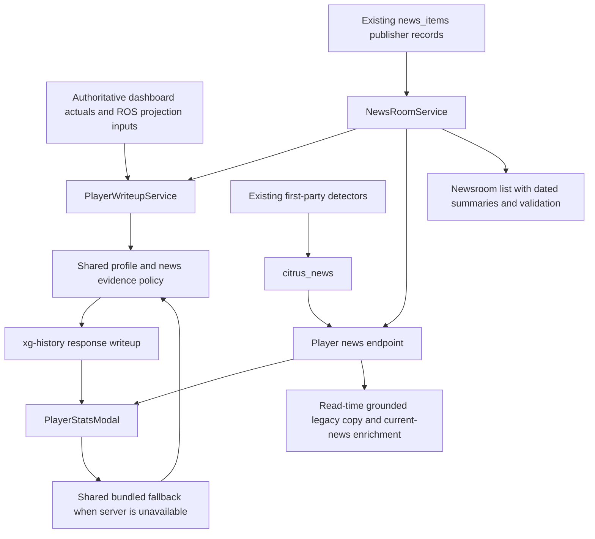

# News-aware Citrus editorial system

Status: local implementation and validation, not deployed. No projection rates, totals, workload, overrides, or detector thresholds were changed by the editorial work. The branch includes the separately owned correctness commits `51b2c3ae`/`1365b357` as cherry-picks; those are distinct from the editorial change.

## Authoring and runtime

The reusable skill is [.agents/skills/citrus-editorial/SKILL.md](../.agents/skills/citrus-editorial/SKILL.md). Its reporting references explain the original editorial approach, not current player news. This is not model training or fine-tuning. Runtime does not read Markdown: the skill's operational counterpart is `packages/shared/src/editorial/`.

- `profile.ts` selects a lead from supplied evidence: combined assists/shooting, goal-led scoring, power-play exposure, assists, shots, physical categories, or goalie ratios/workload. Identity alone no longer changes prose. Supplied league categories change the relevant advice; missing categories remain conditional. Actuals use their own source season, including historical and unknown-season cases. Totals do not establish line assignments, coach intent, job security, or inevitable finishing regression.
- `news.ts` evaluates raw publisher titles/snippets, never generated summaries. It requires a matching numeric player ID and direct full-name subject, valid source URL and publication date, and a supported event. It rejects stale, future, undated, conditional, retrospective, instruction-contaminated and ambiguous evidence. At most two distinct newest health/role events survive; goalie-start reports have a shorter freshness window. Newer unresolved health wording suppresses older definitive injury wording. News does not alter projected GP/rates.
- `CITRUS_EDITORIAL_PROMPT` supplies the shared policy to the newsroom's existing optional model call. No new model service, paid dependency, or model call was added to player assessments.

## Active paths

`PlayerWriteupService` reads the same attached story pipeline as the modal alongside existing directory/scoring reads. A failed news read leaves the statistical assessment available. The shared source builder preserves actuals season, projection season, dashboard composite as-of, and league scoring. No separate editorial stat/projection store exists.

The modal's fallback receives attached raw news and enabled categories, and displays source links when available. Current assessments expose editorial version and source context for inspection. Server assessments are assembled on every request, outside the two-minute raw dashboard/history cache.

All eight first-party Citrus detectors now use grounded mechanism/category language. The player-news route augments only the newest note with a separately dated current report and implication; historical publication date and actuals season remain intact. Known unsafe legacy templates are corrected on read without republishing or a database backfill. Newsroom wire ingest now handles corrected existing URLs, canonicalizes tracking URLs, and rejects missing/future dates. Stored wire summaries are checked on read; invalid prose falls back to a short attributed excerpt.

## Freshness and release boundary

- The server has no persistent assessment cache. New accepted news and current scoring inputs affect the next assessment request. Dashboard source changes remain subject to its existing two-minute cache.
- Open player hooks refresh each minute and on changed news/scoring/source-season revision. Changed player identity immediately masks the previous player's response; stale requests cannot win. Stable polling retains the existing server copy. Disabled/invalid players do not poll.
- No historical note timestamp is rewritten to make old analysis look newly reported. Corrected wire sources trigger bounded re-summarization through the existing ingest path. There is no paid bulk regeneration.
- Backend deployment can improve the server-provided writeup on installed clients already consuming that field, plus newsroom and note responses. This has not been verified on a deployed device here.
- Bundled fallback improvements, open-card refresh behavior, and new source-link rendering require a web release and a new native bundle (Build 19 or later for iOS). Build 18 itself was not rebuilt, submitted, or changed by this task.
- No database migration, deployment, App Store submission, or production write was performed.

## Evaluation and limits

Run `npx tsx scripts/editorial/evaluate.ts` for [six before/after examples](editorial-evaluation/before-after.md), using public NHL 2025-26 actuals captured solely as frozen evaluation fixtures. Four contrasting forwards move from one identical analysis to four distinct analyses after numbers are removed. A separate clearly synthetic practice report demonstrates how news changes the assessment. Fixtures are not runtime data sources.

Behavioral coverage includes source-season preservation, settings sensitivity, same-player news counterfactuals, wrong-player/roundup subjects, date cutoffs, supersession, injection/negation, no GP changes, independent news failure, server/bundle parity, and hook refresh races. The skill's bundled validator also passes. See final task report for the final test totals.

The news parser intentionally omits complex valid prose it cannot attribute confidently. It uses publisher snippets, not full articles. News source outages remain external dependencies. Older records whose dates were fabricated by prior ingestion cannot be retroactively identified from those rows alone. Model-output guards and known legacy-template replacements are conservative checks, not proofs of semantic accuracy. No unsupported tracking, teammate, current unit or medical timeline is invented to make the prose sound richer. Similar evidence can still yield similar analysis; the improvement is choosing distinct supported mechanisms, not arbitrary synonym rotation.

Canonical manually verified TEAMNOTES/status context is owned by the projection reconciliation task. Integration must use that task's authoritative identity, verification, provenance and as-of contract, rather than introducing a second override source. Coordination is pending the exact source-field contract; no unsourced manual context is assumed.
