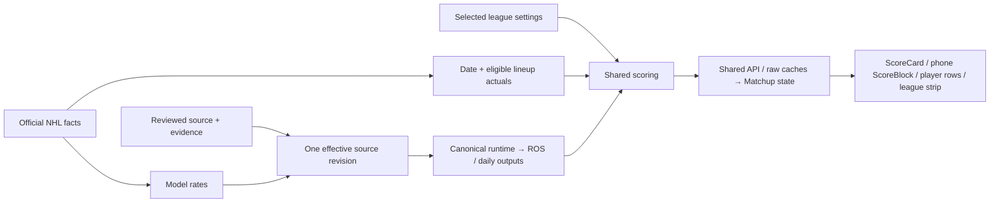

# Source → Matchup cutover

**Local changes are integrated/prepared; production activation and retirement are not yet performed.**

Actual earned points and forecast categories remain separate inputs. Unknown settings/data remain unavailable. Nightly runtime revisions retain the original editable source revision.

| Status | Exact action | Blast radius / restore |
|---|---|---|
| Removed locally | V1/V2 duplicate projection readers and duplicate web scoring paths in integrated runtime commits; three unused cache/scoring helpers in93e382fe. | Shared dashboard/scorer replace duplicate paths. Helper deletion preserves every other module statement; Git revert restores them. |
| Retain | Official/historical facts, reviewed source/run/pointer, ROS/daily materialized tables, model inputs and cron31/34. | These still feed current readers or necessary refresh/fallback paths. Dropping them breaks the pipeline. |
| Quarantine candidate | Only `projection_cache`:1461Januaryrows, about1MB. Exact rename + inverse scripts and backup are prepared. | Old table endpoint stops resolving; same table OID/data/ACL/RLS preserved. Release/external-client proof and actual full-schema restore rehearsal required before production approval. No drop script. |
| Blocked from retirement | raw_shots, external Python invocation, pre_canonical functions. | Reachable readers/no-active-season fallbacks remain. First replace or prove the exact caller; no speculative disablement. |

**Less repeated work:** integrated37241b2f removes repeated Matchup scoring/load paths. Owner's deterministic Wednesday fixture drops actual-stat requests from8to3; future week0, completed week7. Local aggregation~0.13ms/40players is a fixture benchmark, not measured live screen latency. See [runtime evidence](/Users/gstorms/.codex/worktrees/4304/citrus/docs/audits/2026-09-12-matchup-earned-scoring.md).

**Next:** reconciliation finishes source activation/rollback rehearsal → approved release and source activation → validate source-to-screen → accept external-client/cache restore evidence → approve the single cache quarantine → observe and retain backup → separately consider final removal. Full details and executable guards are in [README](README.md).
