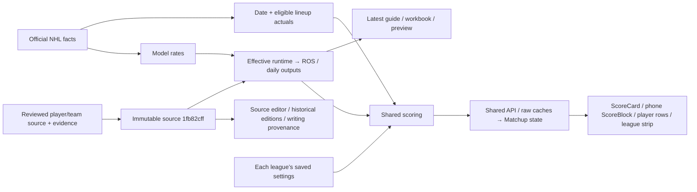

# Source → Matchup cutover

**API/web release `3fd619da`, source `1fb82cff` and effective runtime `858d8a9c` are published and verified. Duplicate readers/scorers and unused helpers are retired in deployed code. `projection_cache` is intentionally retained pending external/direct-client evidence.**

Actual earned points and forecast categories remain separate inputs, scored under each league’s independent saved rules. Unknown settings/data remain unavailable. Guide/workbook exports use explicitly selected preview weights; they do not stand in for a league’s rules. Player writing retains dated source context.

Verified 2026-09-12: immutable source run `73c867f6-f465-4910-a30d-762ceb960385` / revision `1fb82cffbb61e3e9467d3066b61f590b7920ae1fb6ce32abdae0f786d8096e27`; published effective run `b0f2b223-508e-4beb-bcf6-87834a508fc0` / `858d8a9c7f6c0d25e054161d2743b3b728e50f962293e19fa3da7c70861e12fb`, activated10:55:47UTC. Its parent `a2b5d057` came from the earlier controlled existing rebuild at10:02:13UTC; the two timestamps describe different actions. Existing model plus/minus now propagates through ROS/daily and league scoring with signed, zero and missing values preserved. All previous12category rates/counts and workloads remain exactly unchanged. Finalsz673available/Tij-only unavailable; Test night9th674available; all70saved settings unchanged.

Latest default and actual-Finalsz guide/workbook/preview editions use this same effective snapshot and horizon. Both189-page PDFs and workbook caches passed verification across1325profiles/5640present category pairs. Source and previous-runtime editions are preserved. [Current artifacts and exact release evidence](/Users/gstorms/.codex/worktrees/4304/citrus/outputs/projection-reconciliation-20260912/plus-minus-release/RELEASE-RESULT.md).

No actual scheduled refresh has occurred after activation. Active pg_cron job31 next runs September13 at08:50UTC (02:50MDT) to refresh the canonical runtime. Job34 at09:05UTC rematerializes that active snapshot; the GitHub output-health workflow only checks outputs. The existing root heartbeat will observe actual run status, canonical health, source/manual-policy/plus-minus/output/settings preservation and any required effective-edition update. No cron was disabled or manually invoked in this release.

| Status | Exact action | Blast radius / restore |
|---|---|---|
| Deployed retirement | V1/V2 duplicate projection readers and duplicate web scoring paths in integrated runtime commits; three unused cache/scoring helpers in93e382fe. | Shared dashboard/scorer replace duplicate paths. Helper deletion preserves every other module statement; Git revert restores them. |
| Retain | Official/historical facts, reviewed source/run/pointer, ROS/daily materialized tables, model inputs and cron31/34. | These still feed current readers or necessary refresh/fallback paths. Dropping them breaks the pipeline. |
| Intentionally retain compatibility endpoint | `projection_cache`:1461Januaryrows, about1MB. Compiled/internal callers were not found, but authenticated direct table/service clients remain unverified. | Rename would break the old PostgREST/table name. Require external access-log and owner evidence before later quarantine. Same-OID local restore proof is not external-client acceptance. No production rename/drop. |
| Blocked from retirement | raw_shots, external Python invocation, pre_canonical functions. | Reachable readers/no-active-season fallbacks remain. First replace or prove the exact caller; no speculative disablement. |

**Less repeated work:** integrated37241b2f removes repeated Matchup scoring/load paths. Owner's deterministic Wednesday fixture drops actual-stat requests from8to3; future week0, completed week7. Local aggregation~0.13ms/40players is a fixture benchmark, not measured live screen latency. See [runtime evidence](/Users/gstorms/.codex/worktrees/4304/citrus/docs/audits/2026-09-12-matchup-earned-scoring.md).

**Remaining acceptance:** authenticated corrected-web and installed-device source-to-screen checks, and observation of the next actual scheduled refresh. Build19 at unchanged bundled app inputs passed192targeted checks, native assertions, unsigned simulator/device compilation and215asset parity; it was not signed, uploaded or distributed. Existing submission/current App Store status is unverified. No private UI or scheduled-cycle pass is claimed. Native evidence and the intentionally retained cache decision are linked from the release result. Full retirement guards remain in [README](README.md).
