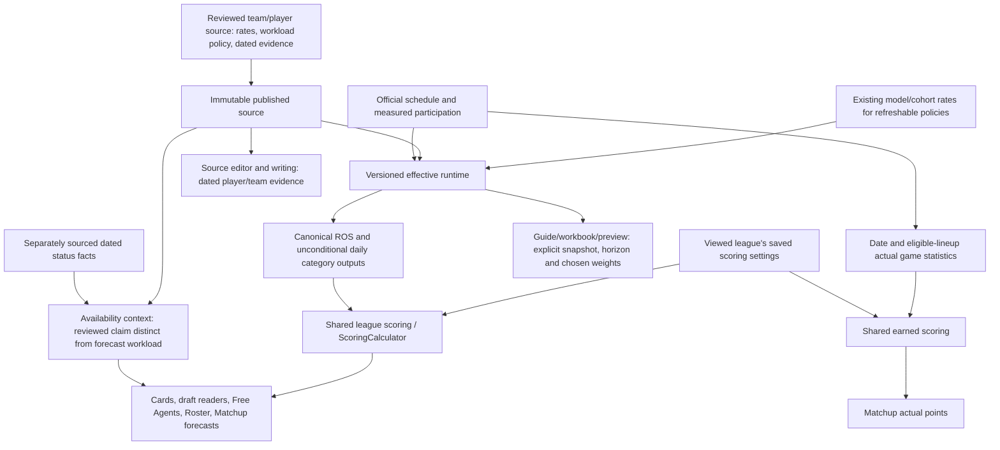

# Citrus source → screen pipeline: current operating map

This is the maintained entry point for projection authority, readers, availability, freshness and retirement. The published source supplies the reviewed forecast and dated availability contract. Use the current release receipt below for serving identity and actual acceptance coverage; implementation and a green build alone do not establish every screen or upstream status fact.

Use the [current manual-baseline receipt](../../../docs/audits/2026-09-12-manual-baseline-release.md) for publication, exports, serving status and remaining acceptance boundaries. The [earlier availability release](../../../docs/audits/2026-09-12-availability-release.md) remains historical evidence. Do not copy changing identities into other “current” maps. Publication identity and model-refresh time are separate. A metadata-only publication preserves numerical values and the inherited refresh time; a later scheduled model refresh may retain the same source.

## Identify the current publication

Use the published view, not the newest local filename, to identify the active season. An authorized read-only operator can query:

```sql
SELECT season, run_id, revision, source_revision, activated_at,
       last_refresh_at, last_refresh_status, last_refresh_error
FROM public.canonical_published_runs
ORDER BY season;
```

`source_payload` on that same view is the original reviewed source; `payload` is its effective runtime. `canonical_published_players` supplies only the current runtime's player context. Compare output `projection_run_id`/`projection_revision` with this pointer. Read API health separately: HTTP200 is not evidence that a particular source revision is active. Record publication and model-refresh times separately, and inspect actual scheduler results before claiming a scheduled refresh completed.

## Authority and flow



| Boundary | Authority and implementation | Important limit |
|---|---|---|
| Source policy | Immutable `source_payload` and `source_revision` in published views; reviewed rate/workload choices, role evidence and team notes. [Publication contract](../../../docs/canonical-projection-pipeline-20260912.md). | Edit/export the original source, not a runtime payload. Reduced GP or expected starts is not an official injury or suspension designation. |
| Effective runtime | Canonical stage → validate → activate with expected-active revision CAS and seasonal lock. Refresh uses persisted policy plus existing `project_ros`/`project_rookies` inputs. | MANUAL policies survive refresh; model inputs are dependencies, not a second editable published forecast. Failed refresh retains the prior snapshot and records failure health. |
| Materialized outputs | `player_ros_projections` and `player_projected_stats`, stamped with run/revision. Activation switches the active pointer and materializes outputs atomically. Active-season write guards reject competing ordinary writers. | ROS is a single-season compatibility table; daily history remains historical. Administrator privilege is outside the application writer guard. |
| Expected workload | Canonical daily categories are unconditional expected volume; daily exposure/categories reconcile to ROS over the stated remaining horizon. | Apply goalie exposure once. Team games, expected starts and confirmed starts are different facts. No confirmed-starter feed is introduced by this pipeline. |
| League forecasts | [Shared league projection helpers](../../../packages/shared/src/leagueProjection/index.ts), using the viewed league's saved settings and supported raw categories. | Never substitute stored default points for missing custom-scoring inputs. Preserve signed/zero values and distinguish a missing category from zero. |
| API and screens | [Player routes](../../../server/src/routes/players.ts), [dashboard service](../../../server/src/services/PlayerDashboardService.ts), [Matchup service](../../../server/src/services/MatchupService.ts) feed the supported web readers. Roster now reads canonical ROS rather than reconstructing it from a truncated daily list. | Current-screen replay covers specified Test/Finalsz weeks, not every consumer, player or missing-value case. Daily-route digit-string compatibility is backend-deliverable; bundled UI corrections require the new client. |
| Earned points | Official game facts, date and eligible lineup → shared scoring → Matchup actuals. | Actuals and forecasts are separately labeled and calculated. Browser replay used offseason zero actuals, not an in-season full-roster recomputation. |
| Exports and writing | Guide/workbook/preview use an explicit effective revision, horizon and selected scoring profile. Source editor and [editorial context](../../../packages/shared/src/editorial/canonicalContext.ts) retain source provenance and dated notes. | Export weights are not a global league setting. Historical source/runtime editions remain historical. A new runtime needs a separately identified effective export, not silent relabeling. |

## Availability is a separate dated fact contract

The [shared contract](../../../packages/shared/src/playerAvailability.ts) separates current dated evidence, a projection scenario, official roster status and fantasy IR eligibility.

- A published `reviewed_report` supplies current display status only with an explicit source date and expiry. The reviewed source validator requires dated attributable evidence, a review date and freshness deadline: an HTTPS report or a named manual confirmation. A review deadline governs freshness; it is never an invented recovery date. Prior source editions remain retained.
- `imported_scenario`/`reviewed_scenario` appears only as separately labelled projection context. Reduced GP, zero starts, surgery narrative or unknown return timetable cannot establish current injury.
- The only recognized supplementary adapter is `espn-injuries`, with its explicit `roster_status_updated_at`. It expires after24hours. Undated/unrecognized-provider values and absence from the feed are unknown, never healthy. This is reported status, not a new official NHL designation feed.
- The most recently dated explicit current evidence wins; equal timestamps favor the reviewed source. If that evidence expires, the answer is unknown rather than resurrecting older evidence. The defensive default review window is2days for DTD and7days otherwise; new reviewed reports require an explicit deadline. Cached display evidence is checked again at render.
- `PlayerService` attaches published availability outside its statistics cache; dashboard attachment uses its existing publication checks; DraftKit forwards that contract. The shared web badge and adapters cover browse, draft rows, Free Agents, PressBox, Roster/mobile roster, Matchup and player modals/cards. The new display property does not mutate `roster_status`, `is_ir_eligible`, lineup slots or saved rules. Current missing evidence shows **Unknown**, with a current-availability explanation.

Citrus’s owner is the manual operational injury/status source until another source is adopted; an automated feed is not a launch prerequisite. Use the [existing manual confirmation workflow](../../projection-review/README.md#manual-injurystatus-authority). Confirm actual facts explicitly and re-review them before expiry; an unknown baseline is not automatically healthy.

The owner adopted the Citrus-authored workbook as the working baseline, not as independently verified injury reporting. Published manual references explicitly retain “workbook adoption only” and “not independently verified.” September12 is the effective adoption date; original report dates and unknown observation dates remain separate. Review deadlines are freshness policy, not recovery dates. Targeted contradictory cases remain Unknown, and the retained Hintz healthy instruction does not require a new external transcript. This does not authorize automatic status changes from forecast workload or fantasy IR eligibility.

The [dated release audit](../../../docs/audits/2026-09-12-availability-release.md) records the observed empty status feed, scheduler inspection and talent-row ownership gap. The live talent rebuild deletes goalie/no-TOI rows, so merely enabling the old job would not make the feed durable. No new feed table or runner change is part of this repair.

The [dated metadata publication receipt](../../../docs/audits/2026-09-12-manual-baseline-release.md) records exact numerical equality and publication constraints. Publish a new source and a metadata-only successor of the current effective runtime through existing stage/validate/CAS activation. Never activate the older source-number payload over the effective runtime or call model refresh to implement a metadata correction. Source staging generates the UUID needed to bind the final runtime hash; review that exact bound identity before activation.

## Freshness and revision boundaries

- Publication is atomic and revision guarded. [CanonicalProjectionService](../../../server/src/services/CanonicalProjectionService.ts) reads published views, keys snapshots by season/run/revision, rejects mixed or changed publication during paged context reads and rechecks active health. Dashboard attachment compares output identity with canonical context.
- Atomic publication does **not** itself prove a multi-request reader cannot span two publications. The daily Matchup and ROS APIs use [a shared read guard](../../../server/src/lib/canonicalProjectionRead.ts): check the season-scoped pointer before and after the full result, require each active row to match season/run/revision, retry once and otherwise return unavailable/error. Pointer failure never silently selects legacy data; a genuinely absent pointer preserves no-active-season behavior. Daily queries use the requested date’s projection season (including the upcoming season before the opener). Empty rows remain missing. This adds two pointer queries to a stable assembled response, up to four with one repeated full read; there is no per-page/player query. Server response consistency does not invalidate all existing browser caches immediately. Historical rows that do not match an existing season pointer are withheld rather than falsely stamped current.
- Server/browser caches and a service worker remain. The app-owned worker update helper offers an explicit Reload action after controller replacement and preserves an open page until the user accepts it. A legacy document cannot show that notice before loading the new bootstrap. The current receipt records actual normal-cache acceptance and any unresolved transition; local helper tests or matching deployed assets are not proof that every existing client upgraded.
- The refresh entrypoint is existing pg_cron job31 at `08:50 UTC`; job34 at `09:05 UTC` rematerializes the active snapshot. The GitHub output-health workflow checks outputs; it is not the model writer. The first post-activation scheduled-cycle acceptance is owned by the coordinator's existing heartbeat. Consult its actual observation rather than treating a scheduled time or a manual test as a completed run.
- Record source activation and model refresh times separately. A code-only deployment does not refresh projections. A newly activated runtime can inherit an earlier model-refresh timestamp.

## Acceptance and native boundary

The current receipt links the baseline and subsequent focused acceptance. The baseline authenticated Test night9th (September27–October3) and Finalsz (September28–October4) replay established that weekly signed plus/minus, expected goalie starts, canonical Roster ROS GP/counts, empty-slot Matchup rendering and separately labeled actual/projected scores passed for the documented examples.

Premium DraftKit/draft access, installed Build18, authenticated digit-string HTTP replay, comprehensive zero/missing UI cases, independent full-roster score recomputation and general service-worker lifecycle coverage remain limited or unexercised. Do not turn these into passes from unit tests. Unsigned Build19 has reviewed app-input validation, not installed-device acceptance; Build18 and prior archives remain preserved. The availability client inputs have a separately identified unsigned candidate; its receipt records validation and preservation of prior archives. A server-only change does not itself require new bundled assets. No signing, upload or distribution is authorized by this map.

The [earned-scoring report](../../../docs/audits/2026-09-12-matchup-earned-scoring.md) contains deterministic request-graph and local fixture evidence. Actual normal-cache Test/Finalsz measurements are recorded in the current receipt, with absolute timing and version limitations. The two Finalsz seven-day request waves contain39 then41 player IDs, so they are not identical duplicates. No production speedup is inferred from endpoint counts or unmatched before/after conditions.

## Retirement, ownership and recovery

| Object/path | Actual disposition | Reason / recovery |
|---|---|---|
| Duplicate integrated readers/scorers and unused helper functions | Removed in reviewed code releases. Later reader repair replaced PM-omitting daily RPC usage and fabricated/truncated Roster ROS aggregation. | Revert/redeploy reviewed compatible code if needed; preserve authoritative data. This does not claim every legacy RPC was deleted. |
| Canonical source/run/pointer, ROS/daily outputs, model inputs, official/raw facts and history | Retained. | These are authority, materializations or evidence, not interchangeable competing forecasts. Preserve source history and required daily history. |
| `projection_cache` | Intentionally retained; no quarantine, rename or drop. | No compiled internal caller found, but direct external/table clients remain unverified. See [retirement evidence and gates](README.md). |
| `*_pre_canonical`, other supported no-active-season paths | Retained. | Existing wrappers still use them where no canonical run is active. One active season does not prove those callers obsolete. |
| `raw_shots` and externally invoked/operator paths | Retained. | Reachable consumers or external ownership remain unresolved. No speculative deletion or schedule disablement. |

The reconciliation/release coordinator owns reviewed source publication and release approval. The canonical scheduled writer owns effective refresh/materialization; the existing heartbeat observes scheduled acceptance. The guide owner owns snapshot-specific exports and authenticated browser acceptance. Native preparation owns isolated unsigned validation only. The status-feed ownership audit is retained above; no runner is enabled by this repair. Dated availability must be re-reviewed by the source owner before its deadline or it becomes unknown.

Retirement review is complete with the explicit retained exceptions above; it does not mean all legacy objects were removed. Supported-coverage review likewise does not create new forecasts: unallocated profiles remain unavailable without reviewed rates and workload. Tij Iginla's missing plus/minus stays missing until a supported input is reviewed. Preserve genuine zero and negative values.

For a code defect, use ordinary reviewed redeployment of prior compatible code without reverting source numbers or league settings. Source/runtime recovery is a separate guarded operation: use the preserved publication/recovery receipts, exact expected-active identity, prior immutable source/runtime and output backups; account for the current date/horizon before any restore. Do not use a stale runtime merely because its files exist. Cache rename/restore scripts are rehearsed candidates, not actions taken in production.

## Supporting evidence

- [Current serving release and actual acceptance receipt](../../../docs/audits/2026-09-12-manual-baseline-release.md): current release facts and links to before/after fingerprints, browser and native evidence. The repository receipt retains the important public identities, exact comparison algorithms and acceptance limits; private raw recovery evidence stays out of git.
- [Canonical publication contract and historical rehearsal](../../../docs/canonical-projection-pipeline-20260912.md): implementation/security boundaries and explicitly dated pre-publication evidence.
- [Retirement inventory and guarded rehearsal](README.md): original inspection evidence and remaining external-caller gates.
- Earlier plus-minus, source activation and guide editions remain provenance. Their release identities and pending-acceptance statements are superseded by the final receipt where later evidence exists.
