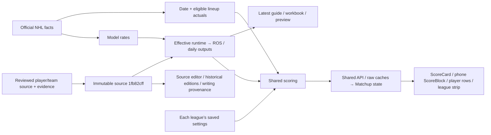

# Source → Matchup cutover

**API/web release `4cf8276a` and reviewed source `1fb82cff` are published. Duplicate readers/scorers and unused helpers are retired in deployed code. Optional `projection_cache` quarantine remains unexecuted.**

Actual earned points and forecast categories remain separate inputs, scored under each league’s independent saved rules. Unknown settings/data remain unavailable. Guide/workbook exports use explicitly selected preview weights; they do not stand in for a league’s rules. Player writing retains dated source context.

Verified 2026-09-12: source run `73c867f6-f465-4910-a30d-762ceb960385` / revision `1fb82cffbb61e3e9467d3066b61f590b7920ae1fb6ce32abdae0f786d8096e27`; controlled existing ROS rebuild succeeded as runtime `099b720a-0880-42ab-91ed-5a4a84db3599` / `a2b5d0572707cee400bb4162474600b7ce3e8e689a1b9064e63d67610c744879`. Model-rate/as-of refresh can change effective forecasts without rewriting reviewed source allocations/manual overrides. Latest previews and new exports must consume the same effective runtime for the same horizon; immutable source editions remain labeled historical/source editions. Effective-runtime latest preview/PDF/workbook parity is verified for all1325 IDs and5052 category pairs. A separate local plus/minus propagation repair is reviewed in [verification](../../../docs/verification/2026-09-12-plus-minus-propagation.md); it is not yet deployed. This is one controlled invocation, not observation of the next scheduled cycle.

| Status | Exact action | Blast radius / restore |
|---|---|---|
| Deployed retirement | V1/V2 duplicate projection readers and duplicate web scoring paths in integrated runtime commits; three unused cache/scoring helpers in93e382fe. | Shared dashboard/scorer replace duplicate paths. Helper deletion preserves every other module statement; Git revert restores them. |
| Retain | Official/historical facts, reviewed source/run/pointer, ROS/daily materialized tables, model inputs and cron31/34. | These still feed current readers or necessary refresh/fallback paths. Dropping them breaks the pipeline. |
| Unexecuted quarantine candidate | Only `projection_cache`:1461Januaryrows, about1MB. Exact rename + inverse scripts and backup are prepared. | Old table endpoint stops resolving; same table OID/data/ACL/RLS preserved. Actual1461-row full-schema quarantine/restore passed; release/external-client proof still required before production approval. No drop script. |
| Blocked from retirement | raw_shots, external Python invocation, pre_canonical functions. | Reachable readers/no-active-season fallbacks remain. First replace or prove the exact caller; no speculative disablement. |

**Less repeated work:** integrated37241b2f removes repeated Matchup scoring/load paths. Owner's deterministic Wednesday fixture drops actual-stat requests from8to3; future week0, completed week7. Local aggregation~0.13ms/40players is a fixture benchmark, not measured live screen latency. See [runtime evidence](/Users/gstorms/.codex/worktrees/4304/citrus/docs/audits/2026-09-12-matchup-earned-scoring.md).

**Remaining acceptance:** authenticated corrected-web and installed-device source-to-screen checks; observation of the next scheduled refresh cycle; supported external-client checks before any separate cache quarantine. Build18 retains old bundled behavior; Build19 compiled unsigned locally and was not distributed. No private UI or scheduled-cycle pass is claimed. Cache quarantine and any later deletion remain separate actions with fresh backup/restore gates. Full details and executable guards are in [README](README.md).
